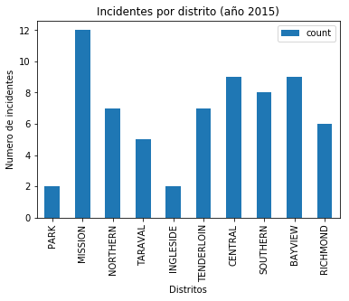
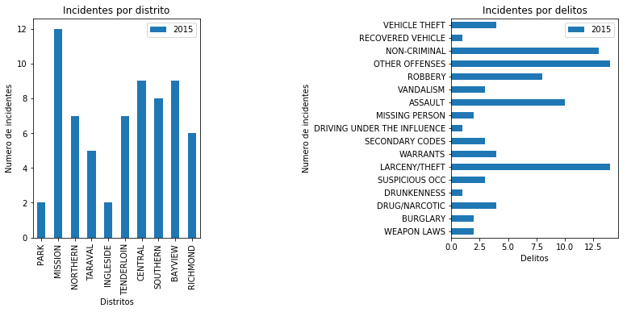

## Cassandra: python driver y consultas/gráficas


```python
%config IPCompleter.greedy=True
%matplotlib inline
from cassandra.cluster import Cluster
import pandas as pd
import numpy as np
import matplotlib.pyplot as plt
```

### Configuración de la sesión, conectores y funciones auxiliares
Para permitir realizar conexiones y consultas de forma genérica hemos implementado un conjunto de funciones
auxiliares. 

* La función *get_session* encapsula la conexión sobre nuestro "keyspace" generando el objeto Session característico del conector de cassandra.

* La función *q* es una abreviatura de *query* y permite acondicionar la realización de consultas y parametrizar valores sobre ellas. El resultado es un objeto tipo *data frame*, por lo cual estaría totalmente adaptado al entorno y sin necesidad de ser característico para el tipo de conector o base de datos.

```
session = get_session("espaciodatos")
q(session, "select * from incidents where incidentId = {id}", id = 10)
```


```python
def get_session(keyspace):
    """Obtiene el conector con la sesión actual al keyspace indicado."""
    return (Cluster(['127.0.0.1']).connect(keyspace))

def q(session, query, **kwargs):
    """Función auxiliar para encapsular las queries producidas por cassandra en formato dataframe."""
    return pd.DataFrame([row for row in session.execute(query.format(**kwargs))])

conn = get_session("incidents")

```

#### Funciones auxiliares
Las siguientes funciones auxiliares son necesarias para agilizar el tratamiento de las consultas sobre todo en la parte de parametrización.


```python

def nowOrdate(date=None):
    """Función auxiliar para permitir un valor por defecto en el timestamp de las queries 
    si no se introduce un valor válido. Por defecto devuelve la fecha actual como timestamp.
    """
    return "dateof(now())" if (date is None) else "'" + date+" 00:00:00'"

def eqOrInIntegers(obj=None):
    """Función que obtiene el operator = o in junto con los valores
    dependiendo si el objeto es una lista o no."""
    return None if obj is None else "in ("+",".join(str(x) for x in obj) + ")" if isinstance(obj, list) else "=" + str(obj)

def eqOrIn(obj=None):
    """Función que obtiene el operator = o in junto con los valores
    dependiendo si el objeto es una lista o no."""
    return None if obj is None else "in ('"+"','".join(str(x) for x in obj) + "')" if isinstance(obj, list) else "='" + obj + "'"
    
```

#### Testeando las funciones auxiliares


```python
[nowOrdate("2014-01-01"), nowOrdate()]
```


    ["'2014-01-01 00:00:00'", 'dateof(now())']


```python
[eqOrIn("categoria1"), eqOrIn(["calle1","calle2"]) ,eqOrIn()]
```


    ["='categoria1'", "in ('calle1','calle2')", None]


```python
[eqOrInIntegers(2015),eqOrInIntegers([2015,2016])]
```


    ['=2015', 'in (2015,2016)']


## Vistas
A continuación mostraremos todas las funciones necesarias para obtener cada una de las vistas
de las consultas analizadas en la fase I:

* ### Obtener incidencias (general)

  * Obtener total de actividad criminal _(getIncidents)_
  * Búsqueda de incidencia _(getIncident)_
  * Búsqueda de incidencias en un rango/periodo de tiempo _(getIncidentsByDate)_


```python
def getIncidents(session, limit = 100):
    return q(session, "select * from incidents.overall limit {limit}",limit=limit)

def getIncident(session, incidentId=None):
    return q(session, "select * from incidents.overall where incidentId={id}",id=incidentId)

def getIncidentsByDate(session, limit = 100, since="2014-01-01", to=None, year=2015):
    print(nowOrdate(since), nowOrdate(to))
    return q(session, "select * from incidents.overall " +
                      "where time >= {since} and time <= {to} and year = {year} allow filtering;",
                     year=year,since=nowOrdate(since), to=nowOrdate(to), limit = limit)
```

**Ejemplo: ** Obtener la actividad criminal denominado con el identificador 140009459


```python
getIncident(conn, incidentId = 140009459)
```


<div>
<style>
    .dataframe thead tr:only-child th {
        text-align: right;
    }

    .dataframe thead th {
        text-align: left;
    }

    .dataframe tbody tr th {
        vertical-align: top;
    }
</style>
<table border="1" class="dataframe">
  <thead>
    <tr style="text-align: right;">
      <th></th>
      <th>year</th>
      <th>time</th>
      <th>incidentid</th>
      <th>subid</th>
      <th>address</th>
      <th>category</th>
      <th>day</th>
      <th>dayoftheweek</th>
      <th>description</th>
      <th>district</th>
      <th>hour</th>
      <th>location</th>
      <th>month</th>
      <th>resolution</th>
      <th>x</th>
      <th>y</th>
    </tr>
  </thead>
  <tbody>
    <tr>
      <th>0</th>
      <td>2014</td>
      <td>2014-01-04 03:52:00</td>
      <td>140009459</td>
      <td>14000945926030</td>
      <td>SACRAMENTO ST / POLK ST</td>
      <td>ARSON</td>
      <td>4</td>
      <td>Saturday</td>
      <td>ARSON</td>
      <td>NORTHERN</td>
      <td>3</td>
      <td>(37.7914943051906, -122.420874632415)</td>
      <td>1</td>
      <td>ARREST, BOOKED</td>
      <td>-122.420874632415</td>
      <td>37.7914943051906</td>
    </tr>
  </tbody>
</table>
</div>


**Ejemplo: ** Obtener la actividad criminal en general (límite de 5 filas)


```python
getIncidents(conn, limit=5)
```


<div>
<style>
    .dataframe thead tr:only-child th {
        text-align: right;
    }

    .dataframe thead th {
        text-align: left;
    }

    .dataframe tbody tr th {
        vertical-align: top;
    }
</style>
<table border="1" class="dataframe">
  <thead>
    <tr style="text-align: right;">
      <th></th>
      <th>year</th>
      <th>time</th>
      <th>incidentid</th>
      <th>subid</th>
      <th>address</th>
      <th>category</th>
      <th>day</th>
      <th>dayoftheweek</th>
      <th>description</th>
      <th>district</th>
      <th>hour</th>
      <th>location</th>
      <th>month</th>
      <th>resolution</th>
      <th>x</th>
      <th>y</th>
    </tr>
  </thead>
  <tbody>
    <tr>
      <th>0</th>
      <td>2014</td>
      <td>2014-01-04 03:52:00</td>
      <td>140009459</td>
      <td>14000945926030</td>
      <td>SACRAMENTO ST / POLK ST</td>
      <td>ARSON</td>
      <td>4</td>
      <td>Saturday</td>
      <td>ARSON</td>
      <td>NORTHERN</td>
      <td>3</td>
      <td>(37.7914943051906, -122.420874632415)</td>
      <td>1</td>
      <td>ARREST, BOOKED</td>
      <td>-122.420874632415</td>
      <td>37.7914943051906</td>
    </tr>
    <tr>
      <th>1</th>
      <td>2015</td>
      <td>2015-02-04 20:27:00</td>
      <td>150098577</td>
      <td>15009857763010</td>
      <td>800 Block of BRYANT ST</td>
      <td>WARRANTS</td>
      <td>4</td>
      <td>Wednesday</td>
      <td>WARRANT ARREST</td>
      <td>SOUTHERN</td>
      <td>20</td>
      <td>(37.775420706711, -122.403404791479)</td>
      <td>2</td>
      <td>ARREST, BOOKED</td>
      <td>-122.403404791479</td>
      <td>37.775420706711</td>
    </tr>
    <tr>
      <th>2</th>
      <td>2015</td>
      <td>2015-02-01 20:35:00</td>
      <td>150098997</td>
      <td>15009899716010</td>
      <td>700 Block of MARKET ST</td>
      <td>DRUG/NARCOTIC</td>
      <td>1</td>
      <td>Sunday</td>
      <td>POSSESSION OF MARIJUANA</td>
      <td>SOUTHERN</td>
      <td>20</td>
      <td>(37.7871160984672, -122.403919148357)</td>
      <td>2</td>
      <td>NONE</td>
      <td>-122.403919148357</td>
      <td>37.7871160984672</td>
    </tr>
    <tr>
      <th>3</th>
      <td>2015</td>
      <td>2015-02-01 20:35:00</td>
      <td>150098997</td>
      <td>15009899703414</td>
      <td>700 Block of MARKET ST</td>
      <td>ROBBERY</td>
      <td>1</td>
      <td>Sunday</td>
      <td>ATTEMPTED ROBBERY ON THE STREET WITH BODILY FORCE</td>
      <td>SOUTHERN</td>
      <td>20</td>
      <td>(37.7871160984672, -122.403919148357)</td>
      <td>2</td>
      <td>NONE</td>
      <td>-122.403919148357</td>
      <td>37.7871160984672</td>
    </tr>
    <tr>
      <th>4</th>
      <td>2015</td>
      <td>2015-02-01 20:30:00</td>
      <td>150098969</td>
      <td>15009896903074</td>
      <td>PALOU AV / QUINT ST</td>
      <td>ROBBERY</td>
      <td>1</td>
      <td>Sunday</td>
      <td>ROBBERY, BODILY FORCE</td>
      <td>BAYVIEW</td>
      <td>20</td>
      <td>(37.7371564713337, -122.396516726913)</td>
      <td>2</td>
      <td>NONE</td>
      <td>-122.396516726913</td>
      <td>37.7371564713337</td>
    </tr>
  </tbody>
</table>
</div>


**Ejemplo: ** Obtener la actividad criminal desde el 2 Enero del 2015 (límite de 5 filas)


```python
getIncidentsByDate(conn, since="2015-01-02", limit = 5)
```

    '2015-01-02 00:00:00' dateof(now())


<div>
<style>
    .dataframe thead tr:only-child th {
        text-align: right;
    }

    .dataframe thead th {
        text-align: left;
    }

    .dataframe tbody tr th {
        vertical-align: top;
    }
</style>
<table border="1" class="dataframe">
  <thead>
    <tr style="text-align: right;">
      <th></th>
      <th>year</th>
      <th>time</th>
      <th>incidentid</th>
      <th>subid</th>
      <th>address</th>
      <th>category</th>
      <th>day</th>
      <th>dayoftheweek</th>
      <th>description</th>
      <th>district</th>
      <th>hour</th>
      <th>location</th>
      <th>month</th>
      <th>resolution</th>
      <th>x</th>
      <th>y</th>
    </tr>
  </thead>
  <tbody>
    <tr>
      <th>0</th>
      <td>2015</td>
      <td>2015-02-04 20:27:00</td>
      <td>150098577</td>
      <td>15009857763010</td>
      <td>800 Block of BRYANT ST</td>
      <td>WARRANTS</td>
      <td>4</td>
      <td>Wednesday</td>
      <td>WARRANT ARREST</td>
      <td>SOUTHERN</td>
      <td>20</td>
      <td>(37.775420706711, -122.403404791479)</td>
      <td>2</td>
      <td>ARREST, BOOKED</td>
      <td>-122.403404791479</td>
      <td>37.775420706711</td>
    </tr>
    <tr>
      <th>1</th>
      <td>2015</td>
      <td>2015-02-01 20:35:00</td>
      <td>150098997</td>
      <td>15009899716010</td>
      <td>700 Block of MARKET ST</td>
      <td>DRUG/NARCOTIC</td>
      <td>1</td>
      <td>Sunday</td>
      <td>POSSESSION OF MARIJUANA</td>
      <td>SOUTHERN</td>
      <td>20</td>
      <td>(37.7871160984672, -122.403919148357)</td>
      <td>2</td>
      <td>NONE</td>
      <td>-122.403919148357</td>
      <td>37.7871160984672</td>
    </tr>
    <tr>
      <th>2</th>
      <td>2015</td>
      <td>2015-02-01 20:35:00</td>
      <td>150098997</td>
      <td>15009899703414</td>
      <td>700 Block of MARKET ST</td>
      <td>ROBBERY</td>
      <td>1</td>
      <td>Sunday</td>
      <td>ATTEMPTED ROBBERY ON THE STREET WITH BODILY FORCE</td>
      <td>SOUTHERN</td>
      <td>20</td>
      <td>(37.7871160984672, -122.403919148357)</td>
      <td>2</td>
      <td>NONE</td>
      <td>-122.403919148357</td>
      <td>37.7871160984672</td>
    </tr>
    <tr>
      <th>3</th>
      <td>2015</td>
      <td>2015-02-01 20:30:00</td>
      <td>150098969</td>
      <td>15009896903074</td>
      <td>PALOU AV / QUINT ST</td>
      <td>ROBBERY</td>
      <td>1</td>
      <td>Sunday</td>
      <td>ROBBERY, BODILY FORCE</td>
      <td>BAYVIEW</td>
      <td>20</td>
      <td>(37.7371564713337, -122.396516726913)</td>
      <td>2</td>
      <td>NONE</td>
      <td>-122.396516726913</td>
      <td>37.7371564713337</td>
    </tr>
    <tr>
      <th>4</th>
      <td>2015</td>
      <td>2015-02-01 20:26:00</td>
      <td>150098975</td>
      <td>15009897564020</td>
      <td>1300 Block of REVERE AV</td>
      <td>NON-CRIMINAL</td>
      <td>1</td>
      <td>Sunday</td>
      <td>AIDED CASE, MENTAL DISTURBED</td>
      <td>BAYVIEW</td>
      <td>20</td>
      <td>(37.728979731984, -122.385545453301)</td>
      <td>2</td>
      <td>NONE</td>
      <td>-122.385545453301</td>
      <td>37.728979731984</td>
    </tr>
    <tr>
      <th>5</th>
      <td>2015</td>
      <td>2015-02-01 20:15:00</td>
      <td>150098953</td>
      <td>15009895304134</td>
      <td>1000 Block of GOETTINGEN ST</td>
      <td>ASSAULT</td>
      <td>1</td>
      <td>Sunday</td>
      <td>BATTERY</td>
      <td>INGLESIDE</td>
      <td>20</td>
      <td>(37.7190699683467, -122.403249637246)</td>
      <td>2</td>
      <td>ARREST, BOOKED</td>
      <td>-122.403249637246</td>
      <td>37.7190699683467</td>
    </tr>
    <tr>
      <th>6</th>
      <td>2015</td>
      <td>2015-02-01 20:00:00</td>
      <td>150098947</td>
      <td>15009894728160</td>
      <td>3400 Block of 16TH ST</td>
      <td>VANDALISM</td>
      <td>1</td>
      <td>Sunday</td>
      <td>MALICIOUS MISCHIEF, VANDALISM OF VEHICLES</td>
      <td>MISSION</td>
      <td>20</td>
      <td>(37.7643418581632, -122.430494795393)</td>
      <td>2</td>
      <td>ARREST, BOOKED</td>
      <td>-122.430494795393</td>
      <td>37.7643418581632</td>
    </tr>
    <tr>
      <th>7</th>
      <td>2015</td>
      <td>2015-02-01 20:00:00</td>
      <td>150098947</td>
      <td>15009894727170</td>
      <td>3400 Block of 16TH ST</td>
      <td>OTHER OFFENSES</td>
      <td>1</td>
      <td>Sunday</td>
      <td>RESISTING ARREST</td>
      <td>MISSION</td>
      <td>20</td>
      <td>(37.7643418581632, -122.430494795393)</td>
      <td>2</td>
      <td>ARREST, BOOKED</td>
      <td>-122.430494795393</td>
      <td>37.7643418581632</td>
    </tr>
    <tr>
      <th>8</th>
      <td>2015</td>
      <td>2015-02-01 20:00:00</td>
      <td>150098947</td>
      <td>15009894726210</td>
      <td>3400 Block of 16TH ST</td>
      <td>ASSAULT</td>
      <td>1</td>
      <td>Sunday</td>
      <td>THREATENING SCHOOL OR PUBLIC EMPLOYEE</td>
      <td>MISSION</td>
      <td>20</td>
      <td>(37.7643418581632, -122.430494795393)</td>
      <td>2</td>
      <td>ARREST, BOOKED</td>
      <td>-122.430494795393</td>
      <td>37.7643418581632</td>
    </tr>
    <tr>
      <th>9</th>
      <td>2015</td>
      <td>2015-02-01 20:00:00</td>
      <td>150098947</td>
      <td>15009894719090</td>
      <td>3400 Block of 16TH ST</td>
      <td>DRUNKENNESS</td>
      <td>1</td>
      <td>Sunday</td>
      <td>UNDER INFLUENCE OF ALCOHOL IN A PUBLIC PLACE</td>
      <td>MISSION</td>
      <td>20</td>
      <td>(37.7643418581632, -122.430494795393)</td>
      <td>2</td>
      <td>ARREST, BOOKED</td>
      <td>-122.430494795393</td>
      <td>37.7643418581632</td>
    </tr>
    <tr>
      <th>10</th>
      <td>2015</td>
      <td>2015-02-01 19:53:00</td>
      <td>150098919</td>
      <td>15009891965015</td>
      <td>MCALLISTER ST / LEAVENWORTH ST</td>
      <td>OTHER OFFENSES</td>
      <td>1</td>
      <td>Sunday</td>
      <td>TRAFFIC VIOLATION</td>
      <td>TENDERLOIN</td>
      <td>19</td>
      <td>(37.7809258336852, -122.413679376888)</td>
      <td>2</td>
      <td>JUVENILE BOOKED</td>
      <td>-122.413679376888</td>
      <td>37.7809258336852</td>
    </tr>
    <tr>
      <th>11</th>
      <td>2015</td>
      <td>2015-02-01 19:53:00</td>
      <td>150098919</td>
      <td>15009891915030</td>
      <td>MCALLISTER ST / LEAVENWORTH ST</td>
      <td>OTHER OFFENSES</td>
      <td>1</td>
      <td>Sunday</td>
      <td>CONTRIBUTING TO THE DELINQUENCY OF MINOR</td>
      <td>TENDERLOIN</td>
      <td>19</td>
      <td>(37.7809258336852, -122.413679376888)</td>
      <td>2</td>
      <td>JUVENILE BOOKED</td>
      <td>-122.413679376888</td>
      <td>37.7809258336852</td>
    </tr>
    <tr>
      <th>12</th>
      <td>2015</td>
      <td>2015-02-01 19:53:00</td>
      <td>150098919</td>
      <td>15009891907041</td>
      <td>MCALLISTER ST / LEAVENWORTH ST</td>
      <td>RECOVERED VEHICLE</td>
      <td>1</td>
      <td>Sunday</td>
      <td>VEHICLE, RECOVERED, AUTO</td>
      <td>TENDERLOIN</td>
      <td>19</td>
      <td>(37.7809258336852, -122.413679376888)</td>
      <td>2</td>
      <td>JUVENILE BOOKED</td>
      <td>-122.413679376888</td>
      <td>37.7809258336852</td>
    </tr>
    <tr>
      <th>13</th>
      <td>2015</td>
      <td>2015-02-01 19:50:00</td>
      <td>150098890</td>
      <td>15009889004014</td>
      <td>100 Block of MASON ST</td>
      <td>ASSAULT</td>
      <td>1</td>
      <td>Sunday</td>
      <td>AGGRAVATED ASSAULT WITH BODILY FORCE</td>
      <td>TENDERLOIN</td>
      <td>19</td>
      <td>(37.7848337315521, -122.409336821846)</td>
      <td>2</td>
      <td>NONE</td>
      <td>-122.409336821846</td>
      <td>37.7848337315521</td>
    </tr>
    <tr>
      <th>14</th>
      <td>2015</td>
      <td>2015-02-01 19:46:00</td>
      <td>150098840</td>
      <td>15009884065016</td>
      <td>TARAVAL ST / 32ND AV</td>
      <td>OTHER OFFENSES</td>
      <td>1</td>
      <td>Sunday</td>
      <td>DRIVERS LICENSE, SUSPENDED OR REVOKED</td>
      <td>TARAVAL</td>
      <td>19</td>
      <td>(37.7424363113581, -122.489620429341)</td>
      <td>2</td>
      <td>ARREST, BOOKED</td>
      <td>-122.489620429341</td>
      <td>37.7424363113581</td>
    </tr>
    <tr>
      <th>15</th>
      <td>2015</td>
      <td>2015-02-01 19:35:00</td>
      <td>150098925</td>
      <td>15009892562050</td>
      <td>6300 Block of GEARY BL</td>
      <td>WARRANTS</td>
      <td>1</td>
      <td>Sunday</td>
      <td>ENROUTE TO OUTSIDE JURISDICTION</td>
      <td>RICHMOND</td>
      <td>19</td>
      <td>(37.7800894126441, -122.487429256289)</td>
      <td>2</td>
      <td>ARREST, BOOKED</td>
      <td>-122.487429256289</td>
      <td>37.7800894126441</td>
    </tr>
    <tr>
      <th>16</th>
      <td>2015</td>
      <td>2015-02-01 19:15:00</td>
      <td>150098599</td>
      <td>15009859965016</td>
      <td>14TH ST / FOLSOM ST</td>
      <td>OTHER OFFENSES</td>
      <td>1</td>
      <td>Sunday</td>
      <td>DRIVERS LICENSE, SUSPENDED OR REVOKED</td>
      <td>MISSION</td>
      <td>19</td>
      <td>(37.7685360123583, -122.41561633832)</td>
      <td>2</td>
      <td>ARREST, CITED</td>
      <td>-122.41561633832</td>
      <td>37.7685360123583</td>
    </tr>
    <tr>
      <th>17</th>
      <td>2015</td>
      <td>2015-02-01 19:06:00</td>
      <td>150098765</td>
      <td>15009876564085</td>
      <td>MISSION ST / DUBOCE AV</td>
      <td>SUSPICIOUS OCC</td>
      <td>1</td>
      <td>Sunday</td>
      <td>INVESTIGATIVE DETENTION</td>
      <td>SOUTHERN</td>
      <td>19</td>
      <td>(37.7701099298175, -122.420010175609)</td>
      <td>2</td>
      <td>NONE</td>
      <td>-122.420010175609</td>
      <td>37.7701099298175</td>
    </tr>
    <tr>
      <th>18</th>
      <td>2015</td>
      <td>2015-02-01 19:06:00</td>
      <td>150098765</td>
      <td>15009876504134</td>
      <td>MISSION ST / DUBOCE AV</td>
      <td>ASSAULT</td>
      <td>1</td>
      <td>Sunday</td>
      <td>BATTERY</td>
      <td>SOUTHERN</td>
      <td>19</td>
      <td>(37.7701099298175, -122.420010175609)</td>
      <td>2</td>
      <td>NONE</td>
      <td>-122.420010175609</td>
      <td>37.7701099298175</td>
    </tr>
    <tr>
      <th>19</th>
      <td>2015</td>
      <td>2015-02-01 19:00:00</td>
      <td>150098981</td>
      <td>15009898106303</td>
      <td>2900 Block of 16TH ST</td>
      <td>LARCENY/THEFT</td>
      <td>1</td>
      <td>Sunday</td>
      <td>PETTY THEFT FROM A BUILDING</td>
      <td>MISSION</td>
      <td>19</td>
      <td>(37.7650244301204, -122.41920245941)</td>
      <td>2</td>
      <td>NONE</td>
      <td>-122.41920245941</td>
      <td>37.7650244301204</td>
    </tr>
    <tr>
      <th>20</th>
      <td>2015</td>
      <td>2015-02-01 18:39:00</td>
      <td>150098674</td>
      <td>15009867465060</td>
      <td>CALIFORNIA ST / POLK ST</td>
      <td>DRIVING UNDER THE INFLUENCE</td>
      <td>1</td>
      <td>Sunday</td>
      <td>DRIVING WHILE UNDER THE INFLUENCE OF DRUGS</td>
      <td>NORTHERN</td>
      <td>18</td>
      <td>(37.7905770710537, -122.420691680792)</td>
      <td>2</td>
      <td>ARREST, BOOKED</td>
      <td>-122.420691680792</td>
      <td>37.7905770710537</td>
    </tr>
    <tr>
      <th>21</th>
      <td>2015</td>
      <td>2015-02-01 18:39:00</td>
      <td>150098674</td>
      <td>15009867465016</td>
      <td>CALIFORNIA ST / POLK ST</td>
      <td>OTHER OFFENSES</td>
      <td>1</td>
      <td>Sunday</td>
      <td>DRIVERS LICENSE, SUSPENDED OR REVOKED</td>
      <td>NORTHERN</td>
      <td>18</td>
      <td>(37.7905770710537, -122.420691680792)</td>
      <td>2</td>
      <td>ARREST, BOOKED</td>
      <td>-122.420691680792</td>
      <td>37.7905770710537</td>
    </tr>
    <tr>
      <th>22</th>
      <td>2015</td>
      <td>2015-02-01 18:39:00</td>
      <td>150098674</td>
      <td>15009867465010</td>
      <td>CALIFORNIA ST / POLK ST</td>
      <td>OTHER OFFENSES</td>
      <td>1</td>
      <td>Sunday</td>
      <td>TRAFFIC VIOLATION ARREST</td>
      <td>NORTHERN</td>
      <td>18</td>
      <td>(37.7905770710537, -122.420691680792)</td>
      <td>2</td>
      <td>ARREST, BOOKED</td>
      <td>-122.420691680792</td>
      <td>37.7905770710537</td>
    </tr>
    <tr>
      <th>23</th>
      <td>2015</td>
      <td>2015-02-01 18:38:00</td>
      <td>150098630</td>
      <td>15009863064010</td>
      <td>1000 Block of FOLSOM ST</td>
      <td>NON-CRIMINAL</td>
      <td>1</td>
      <td>Sunday</td>
      <td>AIDED CASE, DOG BITE</td>
      <td>SOUTHERN</td>
      <td>18</td>
      <td>(37.778254811523, -122.405834032593)</td>
      <td>2</td>
      <td>NONE</td>
      <td>-122.405834032593</td>
      <td>37.778254811523</td>
    </tr>
    <tr>
      <th>24</th>
      <td>2015</td>
      <td>2015-02-01 18:37:00</td>
      <td>150098680</td>
      <td>15009868064085</td>
      <td>HOWARD ST / LAFAYETTE ST</td>
      <td>SUSPICIOUS OCC</td>
      <td>1</td>
      <td>Sunday</td>
      <td>INVESTIGATIVE DETENTION</td>
      <td>SOUTHERN</td>
      <td>18</td>
      <td>(37.7724556440219, -122.416305723264)</td>
      <td>2</td>
      <td>NONE</td>
      <td>-122.416305723264</td>
      <td>37.7724556440219</td>
    </tr>
    <tr>
      <th>25</th>
      <td>2015</td>
      <td>2015-02-01 18:23:00</td>
      <td>150098624</td>
      <td>15009862406243</td>
      <td>300 Block of 9TH ST</td>
      <td>LARCENY/THEFT</td>
      <td>1</td>
      <td>Sunday</td>
      <td>PETTY THEFT FROM LOCKED AUTO</td>
      <td>SOUTHERN</td>
      <td>18</td>
      <td>(37.773130623238, -122.410919016011)</td>
      <td>2</td>
      <td>NONE</td>
      <td>-122.410919016011</td>
      <td>37.773130623238</td>
    </tr>
    <tr>
      <th>26</th>
      <td>2015</td>
      <td>2015-02-01 18:17:00</td>
      <td>150098787</td>
      <td>15009878764070</td>
      <td>BACON ST / HAMILTON ST</td>
      <td>SUSPICIOUS OCC</td>
      <td>1</td>
      <td>Sunday</td>
      <td>SUSPICIOUS OCCURRENCE</td>
      <td>BAYVIEW</td>
      <td>18</td>
      <td>(37.7260849566228, -122.409528258798)</td>
      <td>2</td>
      <td>NONE</td>
      <td>-122.409528258798</td>
      <td>37.7260849566228</td>
    </tr>
    <tr>
      <th>27</th>
      <td>2015</td>
      <td>2015-02-01 18:17:00</td>
      <td>150098787</td>
      <td>15009878715200</td>
      <td>BACON ST / HAMILTON ST</td>
      <td>SECONDARY CODES</td>
      <td>1</td>
      <td>Sunday</td>
      <td>DOMESTIC VIOLENCE</td>
      <td>BAYVIEW</td>
      <td>18</td>
      <td>(37.7260849566228, -122.409528258798)</td>
      <td>2</td>
      <td>NONE</td>
      <td>-122.409528258798</td>
      <td>37.7260849566228</td>
    </tr>
    <tr>
      <th>28</th>
      <td>2015</td>
      <td>2015-02-01 18:09:00</td>
      <td>150098602</td>
      <td>15009860227130</td>
      <td>FRANKLIN ST / SUTTER ST</td>
      <td>OTHER OFFENSES</td>
      <td>1</td>
      <td>Sunday</td>
      <td>POSSESSION OF BURGLARY TOOLS</td>
      <td>NORTHERN</td>
      <td>18</td>
      <td>(37.7873381901532, -122.423404604063)</td>
      <td>2</td>
      <td>ARREST, BOOKED</td>
      <td>-122.423404604063</td>
      <td>37.7873381901532</td>
    </tr>
    <tr>
      <th>29</th>
      <td>2015</td>
      <td>2015-02-01 18:09:00</td>
      <td>150098602</td>
      <td>15009860226170</td>
      <td>FRANKLIN ST / SUTTER ST</td>
      <td>OTHER OFFENSES</td>
      <td>1</td>
      <td>Sunday</td>
      <td>PROBATION VIOLATION</td>
      <td>NORTHERN</td>
      <td>18</td>
      <td>(37.7873381901532, -122.423404604063)</td>
      <td>2</td>
      <td>ARREST, BOOKED</td>
      <td>-122.423404604063</td>
      <td>37.7873381901532</td>
    </tr>
    <tr>
      <th>...</th>
      <td>...</td>
      <td>...</td>
      <td>...</td>
      <td>...</td>
      <td>...</td>
      <td>...</td>
      <td>...</td>
      <td>...</td>
      <td>...</td>
      <td>...</td>
      <td>...</td>
      <td>...</td>
      <td>...</td>
      <td>...</td>
      <td>...</td>
      <td>...</td>
    </tr>
    <tr>
      <th>68</th>
      <td>2015</td>
      <td>2015-02-01 14:30:00</td>
      <td>150098709</td>
      <td>15009870906244</td>
      <td>1300 Block of 16TH AV</td>
      <td>LARCENY/THEFT</td>
      <td>1</td>
      <td>Sunday</td>
      <td>GRAND THEFT FROM LOCKED AUTO</td>
      <td>TARAVAL</td>
      <td>14</td>
      <td>(37.7627511939927, -122.47391580547)</td>
      <td>2</td>
      <td>NONE</td>
      <td>-122.47391580547</td>
      <td>37.7627511939927</td>
    </tr>
    <tr>
      <th>69</th>
      <td>2015</td>
      <td>2015-02-01 14:30:00</td>
      <td>150098395</td>
      <td>15009839506243</td>
      <td>MARTIN LUTHER KING JR DR / KEZAR DR</td>
      <td>LARCENY/THEFT</td>
      <td>1</td>
      <td>Sunday</td>
      <td>PETTY THEFT FROM LOCKED AUTO</td>
      <td>PARK</td>
      <td>14</td>
      <td>(37.7671999403456, -122.458638758608)</td>
      <td>2</td>
      <td>NONE</td>
      <td>-122.458638758608</td>
      <td>37.7671999403456</td>
    </tr>
    <tr>
      <th>70</th>
      <td>2015</td>
      <td>2015-02-01 14:00:00</td>
      <td>150098721</td>
      <td>15009872172000</td>
      <td>41ST AV / LINCOLN WY</td>
      <td>NON-CRIMINAL</td>
      <td>1</td>
      <td>Sunday</td>
      <td>FOUND PROPERTY</td>
      <td>TARAVAL</td>
      <td>14</td>
      <td>(37.7644036412279, -122.500828300284)</td>
      <td>2</td>
      <td>NONE</td>
      <td>-122.500828300284</td>
      <td>37.7644036412279</td>
    </tr>
    <tr>
      <th>71</th>
      <td>2015</td>
      <td>2015-02-01 14:00:00</td>
      <td>150098345</td>
      <td>15009834563010</td>
      <td>1700 Block of HARRISON ST</td>
      <td>WARRANTS</td>
      <td>1</td>
      <td>Sunday</td>
      <td>WARRANT ARREST</td>
      <td>MISSION</td>
      <td>14</td>
      <td>(37.7690748003847, -122.413354187018)</td>
      <td>2</td>
      <td>ARREST, BOOKED</td>
      <td>-122.413354187018</td>
      <td>37.7690748003847</td>
    </tr>
    <tr>
      <th>72</th>
      <td>2015</td>
      <td>2015-02-01 14:00:00</td>
      <td>150098345</td>
      <td>15009834516710</td>
      <td>1700 Block of HARRISON ST</td>
      <td>DRUG/NARCOTIC</td>
      <td>1</td>
      <td>Sunday</td>
      <td>POSSESSION OF NARCOTICS PARAPHERNALIA</td>
      <td>MISSION</td>
      <td>14</td>
      <td>(37.7690748003847, -122.413354187018)</td>
      <td>2</td>
      <td>ARREST, BOOKED</td>
      <td>-122.413354187018</td>
      <td>37.7690748003847</td>
    </tr>
    <tr>
      <th>73</th>
      <td>2015</td>
      <td>2015-02-01 14:00:00</td>
      <td>150098345</td>
      <td>15009834516650</td>
      <td>1700 Block of HARRISON ST</td>
      <td>DRUG/NARCOTIC</td>
      <td>1</td>
      <td>Sunday</td>
      <td>POSSESSION OF METH-AMPHETAMINE</td>
      <td>MISSION</td>
      <td>14</td>
      <td>(37.7690748003847, -122.413354187018)</td>
      <td>2</td>
      <td>ARREST, BOOKED</td>
      <td>-122.413354187018</td>
      <td>37.7690748003847</td>
    </tr>
    <tr>
      <th>74</th>
      <td>2015</td>
      <td>2015-02-01 14:00:00</td>
      <td>150098345</td>
      <td>15009834506362</td>
      <td>1700 Block of HARRISON ST</td>
      <td>LARCENY/THEFT</td>
      <td>1</td>
      <td>Sunday</td>
      <td>PETTY THEFT SHOPLIFTING</td>
      <td>MISSION</td>
      <td>14</td>
      <td>(37.7690748003847, -122.413354187018)</td>
      <td>2</td>
      <td>ARREST, BOOKED</td>
      <td>-122.413354187018</td>
      <td>37.7690748003847</td>
    </tr>
    <tr>
      <th>75</th>
      <td>2015</td>
      <td>2015-02-01 12:45:00</td>
      <td>150098373</td>
      <td>15009837372000</td>
      <td>FRANKLIN ST / TURK ST</td>
      <td>NON-CRIMINAL</td>
      <td>1</td>
      <td>Sunday</td>
      <td>FOUND PROPERTY</td>
      <td>NORTHERN</td>
      <td>12</td>
      <td>(37.7817528767881, -122.42227702764)</td>
      <td>2</td>
      <td>NONE</td>
      <td>-122.42227702764</td>
      <td>37.7817528767881</td>
    </tr>
    <tr>
      <th>76</th>
      <td>2015</td>
      <td>2015-02-01 12:45:00</td>
      <td>150098373</td>
      <td>15009837307021</td>
      <td>FRANKLIN ST / TURK ST</td>
      <td>VEHICLE THEFT</td>
      <td>1</td>
      <td>Sunday</td>
      <td>STOLEN AUTOMOBILE</td>
      <td>NORTHERN</td>
      <td>12</td>
      <td>(37.7817528767881, -122.42227702764)</td>
      <td>2</td>
      <td>NONE</td>
      <td>-122.42227702764</td>
      <td>37.7817528767881</td>
    </tr>
    <tr>
      <th>77</th>
      <td>2015</td>
      <td>2015-02-01 12:00:00</td>
      <td>150098903</td>
      <td>15009890306374</td>
      <td>2900 Block of 24TH ST</td>
      <td>LARCENY/THEFT</td>
      <td>1</td>
      <td>Sunday</td>
      <td>GRAND THEFT OF PROPERTY</td>
      <td>MISSION</td>
      <td>12</td>
      <td>(37.752766726673, -122.410519781929)</td>
      <td>2</td>
      <td>NONE</td>
      <td>-122.410519781929</td>
      <td>37.752766726673</td>
    </tr>
    <tr>
      <th>78</th>
      <td>2015</td>
      <td>2015-02-01 11:45:00</td>
      <td>150098464</td>
      <td>15009846407021</td>
      <td>GROVE ST / VANNESS AV</td>
      <td>VEHICLE THEFT</td>
      <td>1</td>
      <td>Sunday</td>
      <td>STOLEN AUTOMOBILE</td>
      <td>NORTHERN</td>
      <td>11</td>
      <td>(37.7782510832412, -122.419884939457)</td>
      <td>2</td>
      <td>NONE</td>
      <td>-122.419884939457</td>
      <td>37.7782510832412</td>
    </tr>
    <tr>
      <th>79</th>
      <td>2015</td>
      <td>2015-02-01 09:30:00</td>
      <td>150098884</td>
      <td>15009888406244</td>
      <td>2400 Block of JONES ST</td>
      <td>LARCENY/THEFT</td>
      <td>1</td>
      <td>Sunday</td>
      <td>GRAND THEFT FROM LOCKED AUTO</td>
      <td>CENTRAL</td>
      <td>9</td>
      <td>(37.803594011382, -122.416489414289)</td>
      <td>2</td>
      <td>NONE</td>
      <td>-122.416489414289</td>
      <td>37.803594011382</td>
    </tr>
    <tr>
      <th>80</th>
      <td>2015</td>
      <td>2015-02-01 08:00:00</td>
      <td>150098715</td>
      <td>15009871507021</td>
      <td>GOLDEN GATE AV / STANYAN ST</td>
      <td>VEHICLE THEFT</td>
      <td>1</td>
      <td>Sunday</td>
      <td>STOLEN AUTOMOBILE</td>
      <td>RICHMOND</td>
      <td>8</td>
      <td>(37.777023633257, -122.455125552189)</td>
      <td>2</td>
      <td>UNFOUNDED</td>
      <td>-122.455125552189</td>
      <td>37.777023633257</td>
    </tr>
    <tr>
      <th>81</th>
      <td>2015</td>
      <td>2015-01-31 23:30:00</td>
      <td>150098696</td>
      <td>15009869668020</td>
      <td>600 Block of SILVER AV</td>
      <td>OTHER OFFENSES</td>
      <td>31</td>
      <td>Saturday</td>
      <td>MISCELLANEOUS INVESTIGATION</td>
      <td>INGLESIDE</td>
      <td>23</td>
      <td>(37.7288459128524, -122.423207985156)</td>
      <td>1</td>
      <td>NONE</td>
      <td>-122.423207985156</td>
      <td>37.7288459128524</td>
    </tr>
    <tr>
      <th>82</th>
      <td>2015</td>
      <td>2015-01-31 21:00:00</td>
      <td>150098248</td>
      <td>15009824828150</td>
      <td>700 Block of KIRKWOOD AV</td>
      <td>VANDALISM</td>
      <td>31</td>
      <td>Saturday</td>
      <td>MALICIOUS MISCHIEF, VANDALISM</td>
      <td>BAYVIEW</td>
      <td>21</td>
      <td>(37.729203356539, -122.374019331833)</td>
      <td>1</td>
      <td>NONE</td>
      <td>-122.374019331833</td>
      <td>37.729203356539</td>
    </tr>
    <tr>
      <th>83</th>
      <td>2015</td>
      <td>2015-01-31 21:00:00</td>
      <td>150098248</td>
      <td>15009824815200</td>
      <td>700 Block of KIRKWOOD AV</td>
      <td>SECONDARY CODES</td>
      <td>31</td>
      <td>Saturday</td>
      <td>DOMESTIC VIOLENCE</td>
      <td>BAYVIEW</td>
      <td>21</td>
      <td>(37.729203356539, -122.374019331833)</td>
      <td>1</td>
      <td>NONE</td>
      <td>-122.374019331833</td>
      <td>37.729203356539</td>
    </tr>
    <tr>
      <th>84</th>
      <td>2015</td>
      <td>2015-01-31 17:20:00</td>
      <td>150098759</td>
      <td>15009875906243</td>
      <td>400 Block of 10TH ST</td>
      <td>LARCENY/THEFT</td>
      <td>31</td>
      <td>Saturday</td>
      <td>PETTY THEFT FROM LOCKED AUTO</td>
      <td>SOUTHERN</td>
      <td>17</td>
      <td>(37.7709130566165, -122.410541166987)</td>
      <td>1</td>
      <td>NONE</td>
      <td>-122.410541166987</td>
      <td>37.7709130566165</td>
    </tr>
    <tr>
      <th>85</th>
      <td>2015</td>
      <td>2015-01-31 17:00:00</td>
      <td>150098260</td>
      <td>15009826006362</td>
      <td>800 Block of GEARY ST</td>
      <td>LARCENY/THEFT</td>
      <td>31</td>
      <td>Saturday</td>
      <td>PETTY THEFT SHOPLIFTING</td>
      <td>CENTRAL</td>
      <td>17</td>
      <td>(37.7862578545865, -122.417295322526)</td>
      <td>1</td>
      <td>NONE</td>
      <td>-122.417295322526</td>
      <td>37.7862578545865</td>
    </tr>
    <tr>
      <th>86</th>
      <td>2015</td>
      <td>2015-01-31 16:09:00</td>
      <td>150098254</td>
      <td>15009825405053</td>
      <td>200 Block of STOCKTON ST</td>
      <td>BURGLARY</td>
      <td>31</td>
      <td>Saturday</td>
      <td>BURGLARY OF STORE, UNLAWFUL ENTRY</td>
      <td>CENTRAL</td>
      <td>16</td>
      <td>(37.7878092959561, -122.40656817787)</td>
      <td>1</td>
      <td>NONE</td>
      <td>-122.40656817787</td>
      <td>37.7878092959561</td>
    </tr>
    <tr>
      <th>87</th>
      <td>2015</td>
      <td>2015-01-31 01:15:00</td>
      <td>150098583</td>
      <td>15009858371000</td>
      <td>800 Block of MONTGOMERY ST</td>
      <td>NON-CRIMINAL</td>
      <td>31</td>
      <td>Saturday</td>
      <td>LOST PROPERTY</td>
      <td>CENTRAL</td>
      <td>1</td>
      <td>(37.7969934198176, -122.40354422656)</td>
      <td>1</td>
      <td>NONE</td>
      <td>-122.40354422656</td>
      <td>37.7969934198176</td>
    </tr>
    <tr>
      <th>88</th>
      <td>2015</td>
      <td>2015-01-30 22:00:00</td>
      <td>150098470</td>
      <td>15009847006244</td>
      <td>0 Block of CRESTLINE DR</td>
      <td>LARCENY/THEFT</td>
      <td>30</td>
      <td>Friday</td>
      <td>GRAND THEFT FROM LOCKED AUTO</td>
      <td>PARK</td>
      <td>22</td>
      <td>(37.7501301863303, -122.446483988175)</td>
      <td>1</td>
      <td>NONE</td>
      <td>-122.446483988175</td>
      <td>37.7501301863303</td>
    </tr>
    <tr>
      <th>89</th>
      <td>2015</td>
      <td>2015-01-30 21:30:00</td>
      <td>150098812</td>
      <td>15009881206223</td>
      <td>6TH AV / ANZA ST</td>
      <td>LARCENY/THEFT</td>
      <td>30</td>
      <td>Friday</td>
      <td>PETTY THEFT FROM UNLOCKED AUTO</td>
      <td>RICHMOND</td>
      <td>21</td>
      <td>(37.7790877048755, -122.464147081977)</td>
      <td>1</td>
      <td>NONE</td>
      <td>-122.464147081977</td>
      <td>37.7790877048755</td>
    </tr>
    <tr>
      <th>90</th>
      <td>2015</td>
      <td>2015-01-30 12:30:00</td>
      <td>150098834</td>
      <td>15009883405073</td>
      <td>2600 Block of 18TH ST</td>
      <td>BURGLARY</td>
      <td>30</td>
      <td>Friday</td>
      <td>BURGLARY, UNLAWFUL ENTRY</td>
      <td>MISSION</td>
      <td>12</td>
      <td>(37.761791195706, -122.40867573409)</td>
      <td>1</td>
      <td>NONE</td>
      <td>-122.40867573409</td>
      <td>37.761791195706</td>
    </tr>
    <tr>
      <th>91</th>
      <td>2015</td>
      <td>2015-01-29 12:00:00</td>
      <td>150098931</td>
      <td>15009893174000</td>
      <td>600 Block of CLAY ST</td>
      <td>MISSING PERSON</td>
      <td>29</td>
      <td>Thursday</td>
      <td>MISSING ADULT</td>
      <td>CENTRAL</td>
      <td>12</td>
      <td>(37.794611817992, -122.403994862674)</td>
      <td>1</td>
      <td>NONE</td>
      <td>-122.403994862674</td>
      <td>37.794611817992</td>
    </tr>
    <tr>
      <th>92</th>
      <td>2015</td>
      <td>2015-01-29 03:00:00</td>
      <td>150098771</td>
      <td>15009877103014</td>
      <td>16TH ST / MISSION ST</td>
      <td>ROBBERY</td>
      <td>29</td>
      <td>Thursday</td>
      <td>ROBBERY ON THE STREET, STRONGARM</td>
      <td>MISSION</td>
      <td>3</td>
      <td>(37.7650501214668, -122.419671780296)</td>
      <td>1</td>
      <td>NONE</td>
      <td>-122.419671780296</td>
      <td>37.7650501214668</td>
    </tr>
    <tr>
      <th>93</th>
      <td>2015</td>
      <td>2015-01-28 16:00:00</td>
      <td>150098743</td>
      <td>15009874307021</td>
      <td>LINCOLN WY / 38TH AV</td>
      <td>VEHICLE THEFT</td>
      <td>28</td>
      <td>Wednesday</td>
      <td>STOLEN AUTOMOBILE</td>
      <td>TARAVAL</td>
      <td>16</td>
      <td>(37.7645433165084, -122.49761402653)</td>
      <td>1</td>
      <td>NONE</td>
      <td>-122.49761402653</td>
      <td>37.7645433165084</td>
    </tr>
    <tr>
      <th>94</th>
      <td>2015</td>
      <td>2015-01-27 19:00:00</td>
      <td>150098226</td>
      <td>15009822628160</td>
      <td>LOMBARD ST / LAGUNA ST</td>
      <td>VANDALISM</td>
      <td>27</td>
      <td>Tuesday</td>
      <td>MALICIOUS MISCHIEF, VANDALISM OF VEHICLES</td>
      <td>NORTHERN</td>
      <td>19</td>
      <td>(37.8004687042875, -122.431118543788)</td>
      <td>1</td>
      <td>NONE</td>
      <td>-122.431118543788</td>
      <td>37.8004687042875</td>
    </tr>
    <tr>
      <th>95</th>
      <td>2015</td>
      <td>2015-01-19 14:00:00</td>
      <td>150060275</td>
      <td>15006027571000</td>
      <td>18TH ST / VALENCIA ST</td>
      <td>NON-CRIMINAL</td>
      <td>19</td>
      <td>Monday</td>
      <td>LOST PROPERTY</td>
      <td>MISSION</td>
      <td>14</td>
      <td>(37.7617007179518, -122.42158168137)</td>
      <td>1</td>
      <td>NONE</td>
      <td>-122.42158168137</td>
      <td>37.7617007179518</td>
    </tr>
    <tr>
      <th>96</th>
      <td>2015</td>
      <td>2015-01-05 00:01:00</td>
      <td>150098652</td>
      <td>15009865228135</td>
      <td>700 Block of POWELL ST</td>
      <td>OTHER OFFENSES</td>
      <td>5</td>
      <td>Monday</td>
      <td>HARASSING PHONE CALLS</td>
      <td>CENTRAL</td>
      <td>0</td>
      <td>(37.7915661006349, -122.409144009353)</td>
      <td>1</td>
      <td>NONE</td>
      <td>-122.409144009353</td>
      <td>37.7915661006349</td>
    </tr>
    <tr>
      <th>97</th>
      <td>2015</td>
      <td>2015-01-05 00:01:00</td>
      <td>150098652</td>
      <td>15009865215201</td>
      <td>700 Block of POWELL ST</td>
      <td>ASSAULT</td>
      <td>5</td>
      <td>Monday</td>
      <td>STALKING</td>
      <td>CENTRAL</td>
      <td>0</td>
      <td>(37.7915661006349, -122.409144009353)</td>
      <td>1</td>
      <td>NONE</td>
      <td>-122.409144009353</td>
      <td>37.7915661006349</td>
    </tr>
  </tbody>
</table>
<p>98 rows × 16 columns</p>
</div>


* ### Obtener actividad criminal **por zona**

  * Obtener total de actividad criminal por distrito _(getCountByDistrict)_
  * Obtener actividad criminal agrupado por distrito/año _(getByDistrict)_


```python

def getCountByDistrict(session, limit = 100, year=2015):
    return q(session, "select district, count(*) " +
                      "from incidents.bydistrict " +
                      "where year {eqyear} " +
                      "group by district limit {limit}; ", eqyear = eqOrInIntegers(year), limit = limit)

def getByDistrict(session, limit = 100, year=2015, district=None):
    return q(session, "select district, year, incidentid, category, time, location " +
                      "from incidents.bydistrict where year={year} " +
                      (" " if district is None else "and district={district} ") + 
                      "limit {limit}", year=year, limit=limit, district= district)
```

**Ejemplos:** Obtener numero de incidencias por distrito (en un año determinado)


```python
getCountByDistrict(conn, limit=10)
```


<div>
<style>
    .dataframe thead tr:only-child th {
        text-align: right;
    }

    .dataframe thead th {
        text-align: left;
    }

    .dataframe tbody tr th {
        vertical-align: top;
    }
</style>
<table border="1" class="dataframe">
  <thead>
    <tr style="text-align: right;">
      <th></th>
      <th>district</th>
      <th>count</th>
    </tr>
  </thead>
  <tbody>
    <tr>
      <th>0</th>
      <td>PARK</td>
      <td>2</td>
    </tr>
    <tr>
      <th>1</th>
      <td>MISSION</td>
      <td>12</td>
    </tr>
    <tr>
      <th>2</th>
      <td>NORTHERN</td>
      <td>7</td>
    </tr>
    <tr>
      <th>3</th>
      <td>TARAVAL</td>
      <td>5</td>
    </tr>
    <tr>
      <th>4</th>
      <td>INGLESIDE</td>
      <td>2</td>
    </tr>
    <tr>
      <th>5</th>
      <td>TENDERLOIN</td>
      <td>7</td>
    </tr>
    <tr>
      <th>6</th>
      <td>CENTRAL</td>
      <td>9</td>
    </tr>
    <tr>
      <th>7</th>
      <td>SOUTHERN</td>
      <td>8</td>
    </tr>
    <tr>
      <th>8</th>
      <td>BAYVIEW</td>
      <td>9</td>
    </tr>
    <tr>
      <th>9</th>
      <td>RICHMOND</td>
      <td>6</td>
    </tr>
  </tbody>
</table>
</div>


```python
getCountByDistrict(conn, year=[2014], limit=10)
```


<div>
<style>
    .dataframe thead tr:only-child th {
        text-align: right;
    }

    .dataframe thead th {
        text-align: left;
    }

    .dataframe tbody tr th {
        vertical-align: top;
    }
</style>
<table border="1" class="dataframe">
  <thead>
    <tr style="text-align: right;">
      <th></th>
      <th>district</th>
      <th>count</th>
    </tr>
  </thead>
  <tbody>
    <tr>
      <th>0</th>
      <td>NORTHERN</td>
      <td>1</td>
    </tr>
  </tbody>
</table>
</div>


**Ejemplos:** Obtener incidencias agrupadas por distrito (en un año determinado)


```python
getByDistrict(conn, limit=10)
```


<div>
<style>
    .dataframe thead tr:only-child th {
        text-align: right;
    }

    .dataframe thead th {
        text-align: left;
    }

    .dataframe tbody tr th {
        vertical-align: top;
    }
</style>
<table border="1" class="dataframe">
  <thead>
    <tr style="text-align: right;">
      <th></th>
      <th>district</th>
      <th>year</th>
      <th>incidentid</th>
      <th>category</th>
      <th>time</th>
      <th>location</th>
    </tr>
  </thead>
  <tbody>
    <tr>
      <th>0</th>
      <td>PARK</td>
      <td>2015</td>
      <td>150098395</td>
      <td>LARCENY/THEFT</td>
      <td>2015-02-01 14:30:00</td>
      <td>(37.7671999403456, -122.458638758608)</td>
    </tr>
    <tr>
      <th>1</th>
      <td>PARK</td>
      <td>2015</td>
      <td>150098470</td>
      <td>LARCENY/THEFT</td>
      <td>2015-01-30 22:00:00</td>
      <td>(37.7501301863303, -122.446483988175)</td>
    </tr>
    <tr>
      <th>2</th>
      <td>MISSION</td>
      <td>2015</td>
      <td>150098947</td>
      <td>VANDALISM</td>
      <td>2015-02-01 20:00:00</td>
      <td>(37.7643418581632, -122.430494795393)</td>
    </tr>
    <tr>
      <th>3</th>
      <td>MISSION</td>
      <td>2015</td>
      <td>150098599</td>
      <td>OTHER OFFENSES</td>
      <td>2015-02-01 19:15:00</td>
      <td>(37.7685360123583, -122.41561633832)</td>
    </tr>
    <tr>
      <th>4</th>
      <td>MISSION</td>
      <td>2015</td>
      <td>150098981</td>
      <td>LARCENY/THEFT</td>
      <td>2015-02-01 19:00:00</td>
      <td>(37.7650244301204, -122.41920245941)</td>
    </tr>
    <tr>
      <th>5</th>
      <td>MISSION</td>
      <td>2015</td>
      <td>150098527</td>
      <td>WEAPON LAWS</td>
      <td>2015-02-01 17:02:00</td>
      <td>(37.7666737551835, -122.419827929961)</td>
    </tr>
    <tr>
      <th>6</th>
      <td>MISSION</td>
      <td>2015</td>
      <td>150098458</td>
      <td>OTHER OFFENSES</td>
      <td>2015-02-01 16:56:00</td>
      <td>(37.764228935718, -122.419520367886)</td>
    </tr>
    <tr>
      <th>7</th>
      <td>MISSION</td>
      <td>2015</td>
      <td>150098367</td>
      <td>ROBBERY</td>
      <td>2015-02-01 16:20:00</td>
      <td>(37.7651107322703, -122.432198022433)</td>
    </tr>
    <tr>
      <th>8</th>
      <td>MISSION</td>
      <td>2015</td>
      <td>150098856</td>
      <td>NON-CRIMINAL</td>
      <td>2015-02-01 15:30:00</td>
      <td>(37.7564864109309, -122.406539115148)</td>
    </tr>
    <tr>
      <th>9</th>
      <td>MISSION</td>
      <td>2015</td>
      <td>150098345</td>
      <td>WARRANTS</td>
      <td>2015-02-01 14:00:00</td>
      <td>(37.7690748003847, -122.413354187018)</td>
    </tr>
  </tbody>
</table>
</div>


```python
getCountByDistrict(conn, limit=10)
```


<div>
<style>
    .dataframe thead tr:only-child th {
        text-align: right;
    }

    .dataframe thead th {
        text-align: left;
    }

    .dataframe tbody tr th {
        vertical-align: top;
    }
</style>
<table border="1" class="dataframe">
  <thead>
    <tr style="text-align: right;">
      <th></th>
      <th>district</th>
      <th>count</th>
    </tr>
  </thead>
  <tbody>
    <tr>
      <th>0</th>
      <td>PARK</td>
      <td>2</td>
    </tr>
    <tr>
      <th>1</th>
      <td>MISSION</td>
      <td>12</td>
    </tr>
    <tr>
      <th>2</th>
      <td>NORTHERN</td>
      <td>7</td>
    </tr>
    <tr>
      <th>3</th>
      <td>TARAVAL</td>
      <td>5</td>
    </tr>
    <tr>
      <th>4</th>
      <td>INGLESIDE</td>
      <td>2</td>
    </tr>
    <tr>
      <th>5</th>
      <td>TENDERLOIN</td>
      <td>7</td>
    </tr>
    <tr>
      <th>6</th>
      <td>CENTRAL</td>
      <td>9</td>
    </tr>
    <tr>
      <th>7</th>
      <td>SOUTHERN</td>
      <td>8</td>
    </tr>
    <tr>
      <th>8</th>
      <td>BAYVIEW</td>
      <td>9</td>
    </tr>
    <tr>
      <th>9</th>
      <td>RICHMOND</td>
      <td>6</td>
    </tr>
  </tbody>
</table>
</div>


* ### Obtener actividad criminal **por tipo de delito**

  * Obtener total de actividad criminal por categoria _(getCountByCategory)_
  * Obtener actividad criminal agrupado por category/año _(getRangeByCategory)_ permitiendo consultar un rango de fechas.


```python
def getCountByCategory(session, limit = 100, year=2015):
    return q(session, "select category, year, count(*) " +
                      "from incidents.bycategory " +
                      "where year = {year} " +
                      "group by category limit {limit}; ", year = year, limit = limit);

def getRangeByCategory(session, limit = 100, year=2015, since=None, to=None, category=None):
    return q(session, "select category, year, incidentid, category, time, location " +
                      "from incidents.bycategory " +
                      "where year = {year} and " +
                      ("" if category is None else "category {eqCategory} and ") +
                      "time >= {since} and time <= {to} limit {limit} allow filtering ",
             year = year, limit = limit, since=nowOrdate(since), to=nowOrdate(to), eqCategory=eqOrIn(category));
```

**Ejemplo:** Obtener total de actividad criminal agrupado por cateogoria


```python
getCountByCategory(conn, limit = 10)
```


<div>
<style>
    .dataframe thead tr:only-child th {
        text-align: right;
    }

    .dataframe thead th {
        text-align: left;
    }

    .dataframe tbody tr th {
        vertical-align: top;
    }
</style>
<table border="1" class="dataframe">
  <thead>
    <tr style="text-align: right;">
      <th></th>
      <th>category</th>
      <th>year</th>
      <th>count</th>
    </tr>
  </thead>
  <tbody>
    <tr>
      <th>0</th>
      <td>WEAPON LAWS</td>
      <td>2015</td>
      <td>2</td>
    </tr>
    <tr>
      <th>1</th>
      <td>BURGLARY</td>
      <td>2015</td>
      <td>2</td>
    </tr>
    <tr>
      <th>2</th>
      <td>DRUG/NARCOTIC</td>
      <td>2015</td>
      <td>4</td>
    </tr>
    <tr>
      <th>3</th>
      <td>DRUNKENNESS</td>
      <td>2015</td>
      <td>1</td>
    </tr>
    <tr>
      <th>4</th>
      <td>SUSPICIOUS OCC</td>
      <td>2015</td>
      <td>3</td>
    </tr>
    <tr>
      <th>5</th>
      <td>LARCENY/THEFT</td>
      <td>2015</td>
      <td>14</td>
    </tr>
    <tr>
      <th>6</th>
      <td>WARRANTS</td>
      <td>2015</td>
      <td>4</td>
    </tr>
    <tr>
      <th>7</th>
      <td>SECONDARY CODES</td>
      <td>2015</td>
      <td>3</td>
    </tr>
    <tr>
      <th>8</th>
      <td>DRIVING UNDER THE INFLUENCE</td>
      <td>2015</td>
      <td>1</td>
    </tr>
    <tr>
      <th>9</th>
      <td>MISSING PERSON</td>
      <td>2015</td>
      <td>2</td>
    </tr>
  </tbody>
</table>
</div>


**Ejemplo:** Obtener total de actividad criminal agrupado por categoria a partir del 1 Enero de 2015


```python
getRangeByCategory(conn, limit = 10, since= "2015-02-01")
```


<div>
<style>
    .dataframe thead tr:only-child th {
        text-align: right;
    }

    .dataframe thead th {
        text-align: left;
    }

    .dataframe tbody tr th {
        vertical-align: top;
    }
</style>
<table border="1" class="dataframe">
  <thead>
    <tr style="text-align: right;">
      <th></th>
      <th>category</th>
      <th>year</th>
      <th>incidentid</th>
      <th>category_</th>
      <th>time</th>
      <th>location</th>
    </tr>
  </thead>
  <tbody>
    <tr>
      <th>0</th>
      <td>WEAPON LAWS</td>
      <td>2015</td>
      <td>150098420</td>
      <td>WEAPON LAWS</td>
      <td>2015-02-01 17:10:00</td>
      <td>(37.784696907904, -122.413609328985)</td>
    </tr>
    <tr>
      <th>1</th>
      <td>WEAPON LAWS</td>
      <td>2015</td>
      <td>150098527</td>
      <td>WEAPON LAWS</td>
      <td>2015-02-01 17:02:00</td>
      <td>(37.7666737551835, -122.419827929961)</td>
    </tr>
    <tr>
      <th>2</th>
      <td>DRUG/NARCOTIC</td>
      <td>2015</td>
      <td>150098997</td>
      <td>DRUG/NARCOTIC</td>
      <td>2015-02-01 20:35:00</td>
      <td>(37.7871160984672, -122.403919148357)</td>
    </tr>
    <tr>
      <th>3</th>
      <td>DRUG/NARCOTIC</td>
      <td>2015</td>
      <td>150098527</td>
      <td>DRUG/NARCOTIC</td>
      <td>2015-02-01 17:02:00</td>
      <td>(37.7666737551835, -122.419827929961)</td>
    </tr>
    <tr>
      <th>4</th>
      <td>DRUG/NARCOTIC</td>
      <td>2015</td>
      <td>150098458</td>
      <td>DRUG/NARCOTIC</td>
      <td>2015-02-01 16:56:00</td>
      <td>(37.764228935718, -122.419520367886)</td>
    </tr>
    <tr>
      <th>5</th>
      <td>DRUG/NARCOTIC</td>
      <td>2015</td>
      <td>150098345</td>
      <td>DRUG/NARCOTIC</td>
      <td>2015-02-01 14:00:00</td>
      <td>(37.7690748003847, -122.413354187018)</td>
    </tr>
    <tr>
      <th>6</th>
      <td>DRUNKENNESS</td>
      <td>2015</td>
      <td>150098947</td>
      <td>DRUNKENNESS</td>
      <td>2015-02-01 20:00:00</td>
      <td>(37.7643418581632, -122.430494795393)</td>
    </tr>
    <tr>
      <th>7</th>
      <td>SUSPICIOUS OCC</td>
      <td>2015</td>
      <td>150098765</td>
      <td>SUSPICIOUS OCC</td>
      <td>2015-02-01 19:06:00</td>
      <td>(37.7701099298175, -122.420010175609)</td>
    </tr>
    <tr>
      <th>8</th>
      <td>SUSPICIOUS OCC</td>
      <td>2015</td>
      <td>150098680</td>
      <td>SUSPICIOUS OCC</td>
      <td>2015-02-01 18:37:00</td>
      <td>(37.7724556440219, -122.416305723264)</td>
    </tr>
    <tr>
      <th>9</th>
      <td>SUSPICIOUS OCC</td>
      <td>2015</td>
      <td>150098787</td>
      <td>SUSPICIOUS OCC</td>
      <td>2015-02-01 18:17:00</td>
      <td>(37.7260849566228, -122.409528258798)</td>
    </tr>
  </tbody>
</table>
</div>


```python
getRangeByCategory(conn, limit = 100, since= "2015-02-01", category=["WEAPON LAWS","DRUNKENNESS"])
```


<div>
<style>
    .dataframe thead tr:only-child th {
        text-align: right;
    }

    .dataframe thead th {
        text-align: left;
    }

    .dataframe tbody tr th {
        vertical-align: top;
    }
</style>
<table border="1" class="dataframe">
  <thead>
    <tr style="text-align: right;">
      <th></th>
      <th>category</th>
      <th>year</th>
      <th>incidentid</th>
      <th>category_</th>
      <th>time</th>
      <th>location</th>
    </tr>
  </thead>
  <tbody>
    <tr>
      <th>0</th>
      <td>DRUNKENNESS</td>
      <td>2015</td>
      <td>150098947</td>
      <td>DRUNKENNESS</td>
      <td>2015-02-01 20:00:00</td>
      <td>(37.7643418581632, -122.430494795393)</td>
    </tr>
    <tr>
      <th>1</th>
      <td>WEAPON LAWS</td>
      <td>2015</td>
      <td>150098420</td>
      <td>WEAPON LAWS</td>
      <td>2015-02-01 17:10:00</td>
      <td>(37.784696907904, -122.413609328985)</td>
    </tr>
    <tr>
      <th>2</th>
      <td>WEAPON LAWS</td>
      <td>2015</td>
      <td>150098527</td>
      <td>WEAPON LAWS</td>
      <td>2015-02-01 17:02:00</td>
      <td>(37.7666737551835, -122.419827929961)</td>
    </tr>
  </tbody>
</table>
</div>


### Representaciones gráficas

* Representación de la frecuencia de delitos por distritos para un año


```python
df = getCountByDistrict(conn, limit=10)
df.set_index(['district'])
graph = df.plot(kind='bar')
graph.set_xlabel("Distritos")
graph.set_ylabel("Numero de incidentes")
graph.set_title('Incidentes por distrito (año 2015)')
graph.set_xticklabels(df['district'])

```


    [Text(0,0,'PARK'),
     Text(0,0,'MISSION'),
     Text(0,0,'NORTHERN'),
     Text(0,0,'TARAVAL'),
     Text(0,0,'INGLESIDE'),
     Text(0,0,'TENDERLOIN'),
     Text(0,0,'CENTRAL'),
     Text(0,0,'SOUTHERN'),
     Text(0,0,'BAYVIEW'),
     Text(0,0,'RICHMOND')]





* Representación de la frecuencia de delitos por zona/tipo de delito


```python
from pylab import rcParams
rcParams['figure.figsize'] = 13, 5
fig, (ax1, ax2) = plt.subplots(1, 2)


df = getCountByDistrict(conn, limit=10)
graph1 = df.plot(kind='bar', ax=ax1)
graph1.set_xlabel("Distritos")
graph1.set_ylabel("Numero de incidentes")
graph1.set_title('Incidentes por distrito')
graph1.set_xticklabels(df['district'])
ax1.legend(['2015','2016','2017'])

df = getCountByCategory(conn)[['category','count']]
graph2 = df.plot(kind='barh', ax=ax2)
graph2.set_xlabel("Delitos")
graph2.set_ylabel("Numero de incidentes")
graph2.set_title('Incidentes por delitos')
graph2.set_yticklabels(df['category'])
ax2.legend(['2015','2016','2017'])

fig.subplots_adjust(wspace=1.5)
```





Cerramos la conexión con la base de datos


```python
conn.shutdown()

```

Álvaro López
