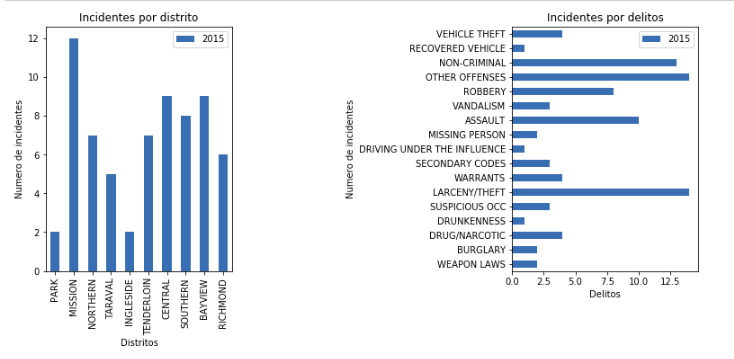

# Fase II: Análisis de datos con Python

* [Introducción](#introducción)
* [Conectores](#conectores)
  * [Cassandra](cassandra/README.md)
  * [Mongodb](mongodb/readme.md)
  * [Neo4j](neo4j/readme.md)
* [Vistas](#vistas)

* Notebooks
  * [Cassandra](cassandra/Analisis-Cassandra.html) [descarga](cassandra/Analisis-Cassandra.ipynb)
  * [Mongodb](mongodb/Analisis-Mongodb.html) [descarga](mongodb/Analisis-Mongodb.ipynb)
  * [Neo4j](neo4j/Analisis-Neo4j.html) [descarga](neo4j/Analisis-Neo4j.ipynb)
----

## Introducción

A continuación disponemos de una pequeña explicación de los conectores usados y las ventajas por las capacidades que ofrecen o por la naturaleza de la base de datos. 

### Cassandra

*cassandra.cluster*. Contiene una clase principal denominada *Cluster* que se conecta a un cluster de Cassandra estableciendo
una conexión encapsulada en el objeto _Session_. Se pueden añadir ciertas configuraciones en acorde a la arquictura definida o a la forma 
de conexión: 

Ventajas:

  * Permite balanceo de carga entre los nodos disponibles
  * Pool de threads para conexiones
  * Permite añadir una capa de seguridad

Toda esta información esta reflejada en el documento oficial que podemos encontrar bajo [https://datastax.github.io/python-driver/api/cassandra/cluster.html]].

### Mongodb

El paquete *pymongo* contiene herramientas para trabajar desde Python con MongoDb. La estructura de los datos en documentos tipo JSON con un esquema dinámico llamado BSON, lo que implica que no existe un esquema predefinido. Los elementos de los datos se denominan documentos y se guardan en colecciones
A parte del manejo de datos, la librería permite realizar:

Más información de la libreria: [[https://api.mongodb.com/python/current/index.html]]

Ventajas:

  * Permite añadir una capa de seguridad
  * Capacidad de manejo de datos en formatos de documentos, con capacidad dinámica.
  * Capacidad de transformación de tipos de datos, sobre todo fechas.
  * Añade geoespacialidad para los datos relacionados con las coordenadas

### Neo4j

El conector _neo4j-driver_está basado en el driver oficial de Neo4J para Python. Esto ha implicado una transformación de las funciones por defecto para poder obtener resultados que sean útiles más tarde para nuestra aplicación.

## Representaciones

Hemos generalizado los tipos de consultas dependendiendo a las expectativas sobre la aplicación, 
todas ellas se encuentran reflejadas como tablas y algunas representaciones gráficas para formar
las correspondientes consultas:

* Obtener toda las incidencias y realizar consultas específicas
* Actividad criminal por zona / Numero de incidencias
* Actividad criminal por tipo de delito / Nùmero de incidencias

Todas se pueden encontrar implementadas en el notebook correspondiente a cada tipo de base de datos:

* [Cassandra](cassandra/Analisis-Cassandra.html) [descarga](cassandra/Analisis-Cassandra.ipynb)
* [Mongodb](mongodb/Analisis-Mongodb.html) [descarga](mongodb/Analisis-Mongodb.ipynb)
* [Neo4j](neo4j/Analisis-Neo4j.html) [descarga](neo4j/Analisis-Neo4j.ipynb)

## Referencias

* Cassandra: https://github.com/pycassa/pycassa

* Paginator: https://simpleisbetterthancomplex.com/tutorial/2016/08/03/how-to-paginate-with-django.html

* Maps: http://blog.mathieu-leplatre.info/geodjango-maps-with-leaflet.html

## Colaboración

* Julio _(@melferas)_
* Lupicinio García Ortiz _(@orial)_
* Álvaro López _(@vrandkode)_
