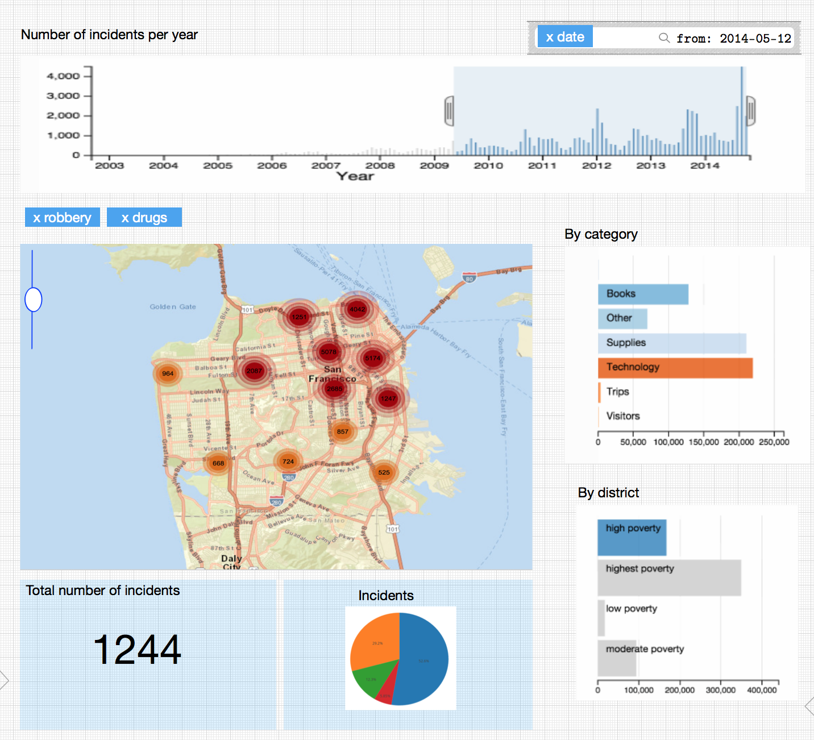

Basicamente la vista principal contiene una interacción con los datos estáticos de los datos actuales, los cuales podemos afinar con respecto a un filtro de **rango de fechas**.

## Requisitos

* Vistas: filtro: rango de fechas

- Mapa de calor (Mongodb)

- Barra por districto (Cassandra)

- Barra por categoria (Cassandra)

- Numero de incidencias por dia/mes/año (Cassandra o Mongodb)

- Total numero de incidencias (Neo4j)

