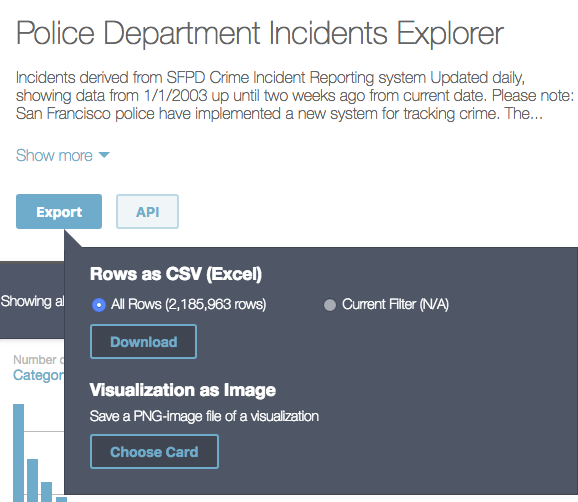
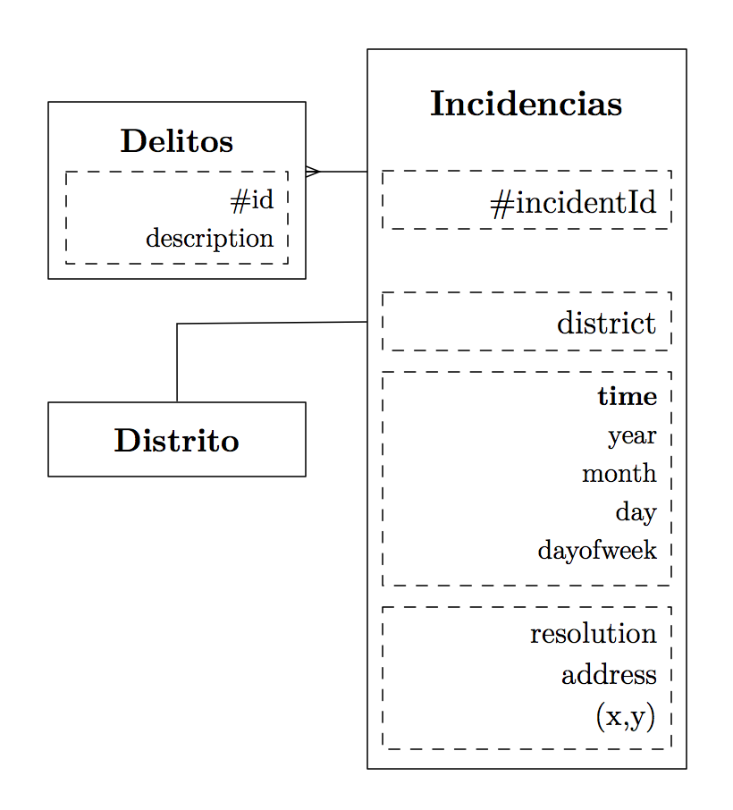
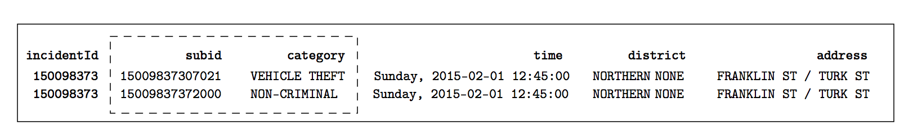

# Cassandra

Representación y modelado de datos de actividades criminales con respecto a localizaciones o por periodos de tiempo entre los años 2003 y 2018 mediante Cassandra.

* [Introducción]
* *Modelado de datos*
  * [Almacenamiento de datos]
  * [Estructura de datos]
  * [Consultas]
    * Ver actividad criminal en un periodo de tiempo
    * Ver actividad criminal en una zona de la ciudad
    * Agregados por periodos de tiempo
    * Agregadps por zona o tipo caso
* [Configuracion e instalación]
* [Procesamiento de datos]

---
## Introducción

La información del dataset proporcionada por el departamento _Policial de San Francisco_ contiene datos de todas las incidencias generadas por actividades criminales producidas desde el año 2003 hasta la actualidad. Esta información se encuentra expuesta de forma pública desde el sistema de actualización diaria del SFPD Crime Incident Reporting (sistema de reportes del departamento policial) a traves de su plataforma Socrata.


*¿Dónde podemos encontrar los datos?* La fuente de datos necesaria para realizar nuestro análisis de datos se puede descargar desde la vista ofrecida por Socrata para dicho reporte, bajo: 

https://dev.socrata.com/foundry/data.sfgov.org/cuks-n6tp

Desde la página principal, que ofrece la visualización de un mapa de incidencias basado en este dataset, solamente se pueden descargar versiones con información para el año actual. Esto ocurre desde la fecha del 3 de Marzo del 2018, bajo indicación de la última notificación, ofrecida desde la vista Socrata para dicho reporte:

```
[Change Notice 03/13/2018]: By the end of this month, this dataset will become historical and a new one will be created starting with incident data in 2018. This one will remain here, but no longer be updated. The new one will have data coming from a new system, will not have a 2 week lag, and have updated districts among other quality improvements. We will attach a guide here with more detailed change updates as soon as we have them.
```

El dataset, sin filtros y con información desde el 2013 hasta la actualidad (dos semanas antes de la fecha actual), se puede descargar como CSV a partir de https://data.sfgov.org/d/tmnf-yvry.




## Almacenamiento de datos

El mapa de incidencias se puede descargar mediante línea de comandos:
```
wget -O incidents.raw.tsv "https://data.sfgov.org/api/views/tmnf-yvry/rows.tsv?accessType=DOWNLOAD&api_foundry=true"
```
La información en CSV (con tabulador como separador) se encuentra estructurada en bruto de la siguiente manera:

```
IncidntNum	Category	Descript	DayOfWeek	Date	Time	PdDistrict	Resolution	Address	X	Y	Location	PdId
150060275	NON-CRIMINAL	LOST PROPERTY	Monday	01/19/2015	14:00	MISSION	NONE	18TH ST / VALENCIA ST	-122.42158168137	37.7617007179518	(37.7617007179518, -122.42158168137)	15006027571000
```

## Estructura de datos

En *Cassandra*, el diseño y definición de un modelo de datos se procede una vez conocidas las metas y sentencias necesarias para la visualización final de la información a analizar. Se sugiere seguir una series de pautas para conseguir un modelado de datos idóneo para el análisis y el procesamiento masivo de datos.

Hay dos metas importantes a tener en cuenta para el modelado de datos en *Cassandra*:

* Definir un procedimiento para repartir la información de forma equitativa y horizontal en los _clusters_ definidos.
* Minimizar el numero de lectura de particiones. 

*Análisis de requisitos*. Se requiere obtener y visualizar la actividad criminal para *periodos de tiempo* de ciertas *zonas* de la ciudad. 

*Identificar entidades y relaciones*. Cada línea del documento contiene información de la relación *incidencia-delito*. Cada incidencia se puede desglosar en varios causas delictivas o delitos. La relación natural entre las entidades mencionadas queda representada en el siguiente diagrama:





Dado que el modelo de datos se hace en acorde a las sentencias y no sobre las entidades o relaciones, no se requiere de un diseño alejado de la forma natural representada en los datos mencionados. En tal caso, se tendrá en cuenta la representación actual de las incidencias pero para distintos escenarios por cada sentencia requerida.

*Identificar sentencias*. La mejor manera de particionar las lecturas es modelar los datos en acorde a las sentencias, que son dadas por los requisitos. De primera instancia hay que considerar los siguientes puntos antes de realizar la definición de las sentencias:

  * Agrupación por un atributo: por distrito, por tipo de actividad criminal
  * Ordenación por un atributo: por tiempo
  * Filtro basado en un conjunto de condiciones.

A partir de aquí, desde otra perspectiva de alto nivel, nuestro objetivo consistirá en clasificar las requeridas incidencias y recuperar la información de la actividad criminal (cantidad/frecuencia), en *periodos de tiempo*, de forma *ordenada*, y dada ciertas condiciones definidas: por *distrito* o *tipo de delito*.

La visualización de la actividad criminal se consigue mediante la representación de las incidencias producidas para cada atributo: periodo de tiempo, por cada zona ó tipo de delito. Para una perspectiva de análisis un poco más precisa, se necesitaría representar la cuantificación mediante uso de proporciones o frecuencias para un determinado grupo de atributos o condiciones.

* Frecuencia criminal por periodos de tiempo: horas o día de la semana para cierto año.
* Frecuencia criminal por cada zona.
* Proporción de la incidencia de diferentes actividades delíctivas.

*Especificación del esquema*. La especificación del esquema vendrá determinado por la consulta o tipo de consulta que la requiera. Todos los esquemas se pueden generar obtenidos desde [schema.cql](cql/schema.cql)

## Consultas

### Ver actividad criminal en un periodo de tiempo

### Ver actividad criminal en una zona de la ciudad

### Agregados por periodos de tiempo

### Agregadps por zona o tipo caso

[_volver_](#cassandra)


* Procesamiento de datos

Una vez creados los esquemas de tablas necesarias para el modelo de datos procedemos al preprocesamiento de los datos descargados desde el portal de información de incidencias para trabajar con datos limpios y en acorde al formato de los atributos que utilizaremos para dichas tablas. Se realizarán los siguientes cambios con respecto a los datos en bruto:

* Formato timestamp para definir el campo 'time', a partir de las columnas 'Date' y 'Time' ('01/19/2015' y '14:00') para obtener '2015-01-19 14:00:00'.
* Campos de agrupación relacionados con periodos de tiempo: year, month, day, hour, basados en los campos anteriores. Los cuales serán necesarios para las particiones de datos por año y/o búsqueda por horas.

Para descargar y realizar este limpiado de datos in-situ lo podemos realizar desde la línea de comandos de la siguiente manera:

```
wget -O- "https://data.sfgov.org/api/views/tmnf-yvry/rows.tsv?accessType=DOWNLOAD&api_foundry=true" |tail -n +2 | tr '\t' ';' | sed -E 's/([0-9]+)\/([0-9]+)\/([0-9]+);([0-9]+):([0-9]+)/\3-\1-\2 \4:\5:00;\2;\3;\1;\4/g' > incidents.raw_data.csv
```

o una vez descargado el dataset en 'incidents.raw.tsv' con las 2 millones de entradas, realizamos el mismo tipo de procesamiento:

 ```
 $ nice cat incidents.raw.tsv |wc -l
 2185964
 ```

```
 $ nice cat incidents.raw.tsv |tail -n +2 | tr '\t' ';' | sed -E 's/([0-9]+)\/([0-9]+)\/([0-9]+);([0-9]+):([0-9]+)/\3-\1-\2 \4:\5:00;\2;\3;\1;\4/g' > incidents.dataset.csv
 ```

Una muestra del resultado la podemos encontrar en el fichero [incidents.dataset.sample.100.tsv](dataset/incidents.dataset.sample.100.tsv) generado a partir del original [incidents.raw.sample.100.tsv](dataset/incidents.raw.sample.100.tsv).

```
...
150060275;NON-CRIMINAL;LOST PROPERTY;Monday;2015-01-19 14:00:00;19;2015;01;14;MISSION;NONE;18TH ST / VALENCIA ST;-122.42158168137;37.7617007179518;(37.7617007179518, -122.42158168137);15006027571000
150098210;ROBBERY;ROBBERY, BODILY FORCE;Sunday;2015-02-01 15:45:00;01;2015;02;15;TENDERLOIN;NONE;300 Block of LEAVENWORTH ST;-122.414406029855;37.7841907151119;(37.7841907151119, -122.414406029855);15009821003074
...
```

A partir de aquí se procede al volcado de datos a una tabla de índole general
```

```


[_volver_](#cassandra)

# Configuracion e instalación

## Requerimientos

* Cassandra 
* hsqlc

## Installation
* Download cassandra
* Run ./cassandra


## Importing Incidents data

* Downloading the Incidents dataset from _TSV for Excel_ version from https://data.sfgov.org/Public-Safety/Map-of-Police-Department-Incidents/gxxq-x39z and clean data before importing: removing the headers, transform and merge the date/time into time field. The results will be saved under incidents.tsv


*[Change Notice 03/13/2018]: By the end of this month, this dataset will become historical and a new one will be created starting with incident data in 2018. This one will remain here, but no longer be updated. The new one will have data coming from a new system, will not have a 2 week lag, and have updated districts among other quality improvements. We will attach a guide here with more detailed change updates as soon as we have them.*

```
wget -O- "https://data.sfgov.org/api/views/tmnf-yvry/rows.tsv?accessType=DOWNLOAD&api_foundry=true" |tail -n +2|sed -E 's/([0-9]+)\/([0-9]+)\/([0-9]+) ([0-9\:]+) [A-M]+.([0-9\:]+)/\3-\1-\2 \5:00/g' > incidents.tsv
```
```
wget -O- "https://data.sfgov.org/api/views/tmnf-yvry/rows.tsv?accessType=DOWNLOAD&api_foundry=true"|tail -n +2|tr '\t' ';' | sed -E 's/([0-9]+)\/([0-9]+)\/([0-9]+);([0-9\:]+[0-9]+)/\3-\1-\2 \4:00;\2;\3;\1/g' | sed -E "s/;[0-9]+$/;`uuidgen | tr '[:upper:]' '[:lower:]'`/g" | sed -E 's/ ([0-9]+):([0-9]+):([0-9]+);/ \1:\2:\3;\1;/g' > incidents-with-uid.c
```

wget -O- "https://data.sfgov.org/api/views/tmnf-yvry/rows.tsv?accessType=DOWNLOAD&api_foundry=true" | tr '\t' ';' | sed -E 's/([0-9]+)\/([0-9]+)\/([0-9]+);([0-9]+):([0-9]+)/\3-\1-\2 \4:\5:00;\2;\3;\1;\4/g' > incidents.raw_data.csv

## Design notes

Data on each node according to the value of the partition key and the range that the node is responsible for.

The correct way to model this is to first find a different column by which to partition the data

Queries will return data that is sorted according to the clustering key(s) only when a partition key is also specified.  Without a partition key specified in the WHERE clause, the actual order of the result set then becomes dependent on the hashed values of primary key.

For tables supporting queries for recent, time-based data, you may want to specify a “DESCending” sort direction in your table definition.


* Creating keyspace (use _DevCenter_ or cql shell ```./datastax-ddc-3.9.0/bin/cqlsh```)
```
CREATE KEYSPACE incidents
WITH replication = {'class': 'SimpleStrategy',
'replication_factor' : 1};
```

* Create incidents table
```
CREATE TABLE IF NOT EXISTS incidents (
  id text PRIMARY KEY,
  category text,
  description ascii,
  dayoftheweek text,
  time timestamp,
  district text,
  resolution text,
  address text,
  x text,
  y text,
  location text
);
```

* Check if keyspace was created
```
cqlsh> describe keyspaces;

delitos        system_auth  incidents           system_traces
system_schema  system       system_distributed  personas
```

* Import data to table incidents
```
cqlsh> COPY incidents(id, category, description, dayoftheweek, time, district, resolution, address,x,y,location) 
FROM 'dataset/incidents.tsv' 
WITH DELIMITER='\t' and CHUNKSIZE=500 and INGESTRATE=2000 and HEADER=false and DATETIMEFORMAT='%Y-%m-%d %H:%M:%S';
```

```
Processed: 25210 rows; Rate:    1094 rows/s; Avg. rate:    2024 rows/s
25210 rows imported from 1 files in 12.453 seconds (0 skipped).
```

---

### Data modeling

From dasbhoard: [[http://kdm.dataview.org/kdm.jsp]]

## Queries

Tablas requeridas para realizar las consultas:

```
CREATE TABLE incidencias.category (category text, cyclist_name text, flag int STATIC, PRIMARY KEY (country, cyclist_name));
```


Necesitamos diseñar para cada tipo de de base de datos para poder listar las siguientes consultas:

* Número de incidencias por zona/dia

```
select *
```

* Número de incidencias por año/dia (por tipo de delito)

```
select *
```
* Frecuencia de incidencias por dia de la semana

```
select *
```
---
References:

http://cassandra.apache.org/doc/latest/cql/dml.html


---
## Troubleshooting
### Is Cassandra running

Linux
```
netstat -ap tcp | grep -i "listen"|grep 9042
```

Macos
```
sudo lsof -PiTCP -sTCP:LISTEN|grep 9042
java      41458 vrandkode  190u  IPv4 0x32271e72c028899      0t0  TCP localhost:9042 (LISTEN)
```

### Installing DevCenter

* DevCenter closes bceause of java virtual machine
Edit DevCenter.app/Contents/devcenter.ini and add the line
```
-vm
/Library/Java/JavaVirtualMachines/jdk1.8.0_51.jdk/Contents/Home/bin
```


