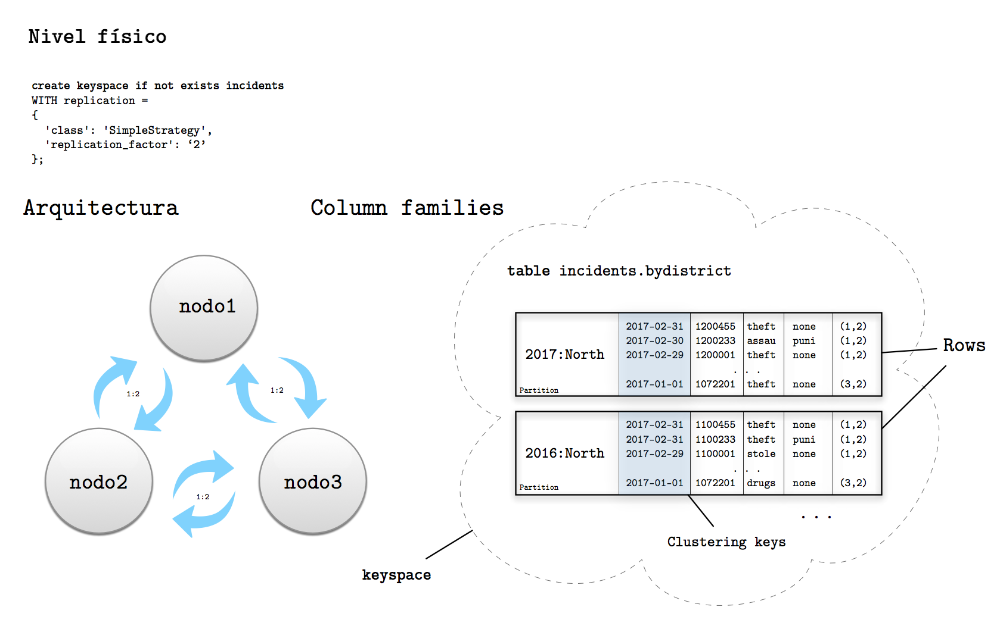
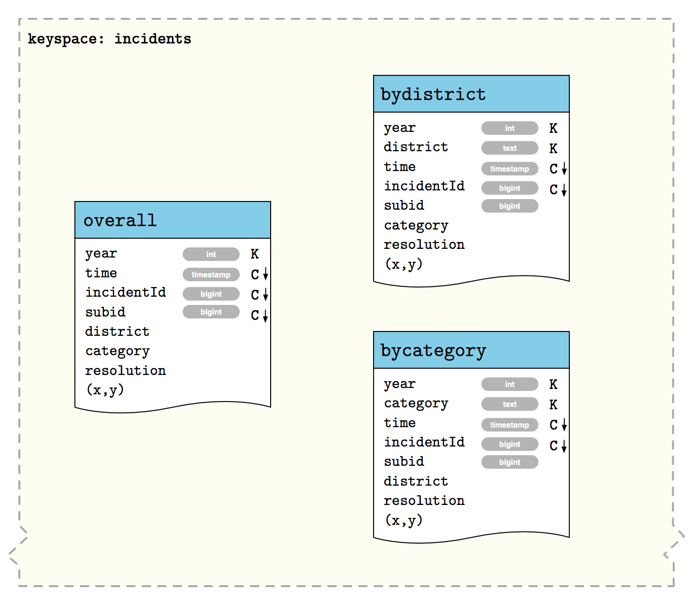
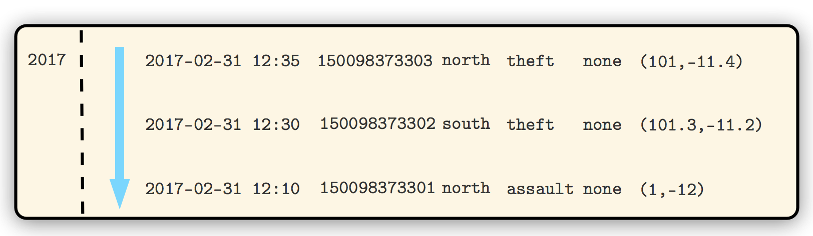
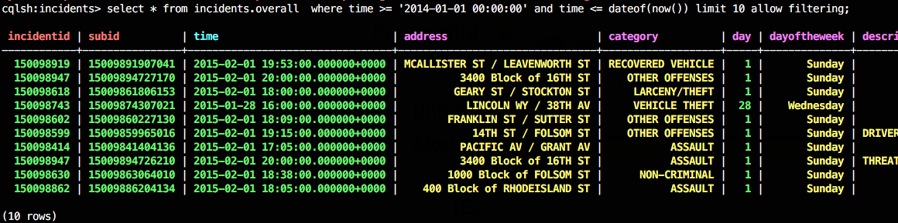
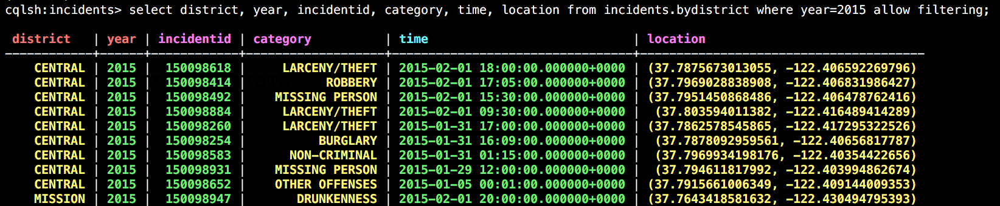
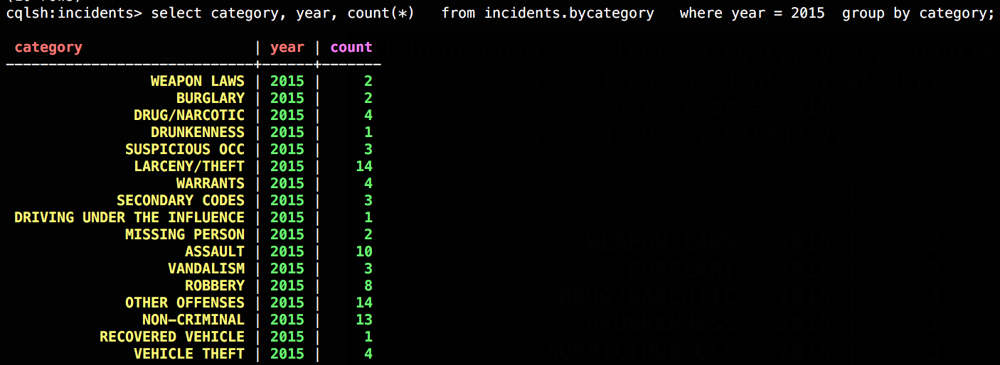
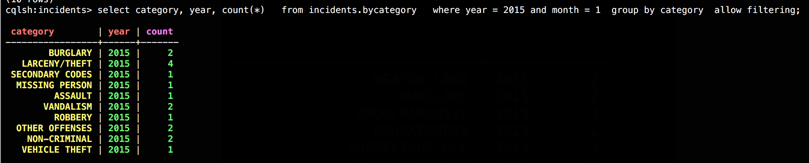

# Cassandra

* [Introducción](#introducción)

* [Primeros pasos](#instalación-y-configuración)
    * [Requerimientos técnicos](#requerimientos-técnicos)
    * [Pasos](#instalación)

* [Preprocesamiento e importación de datos](#preprocesamiento-e-importación-de-datos)
  * [Limpieza de datos](#limpieza-de-datos)
  * [Importación](#importación-de-datos)

* [Estructura y Modelado de datos](#estructura-de-datos)
  * [Diseño](#diseño)
  * [Identificación de consultas](#identificación-de-consultas)
  * [Modelado de datos](#modelado-de-datos)

* [Consultas](#consultas)

* [Referencias](#referencias)

---

## Introducción

_Cassandra_ es una base de datos dependiente del *caso de uso*. En la mayoría de los casos, una simple instancia de MySQL o PostgreSQL haría mejor el trabajo.

La idea principal es que encontremos que Cassandra pueda ofrecer facilidades con respecto a la organización de los **atributos** en nuestro modelo de datos.

El uso de Cassandra tiene muchos pros y contras diferentes, muchos de los cuales dependen de lo que se quiera hacer con él. 

**Pros**

* **Consistencia estable y replicación de datos**. La relación entre la **estructura lógica y la física** permite que la información quede estructurada y organizada entre los nodos, con el fin de optimizar y almacenar la información entre ellos. 

* **Redundancia de información**. La información se encuentra organizada entre los nodos de forma redundante a su vez.

* *CQL* Lenguaje de consulta de Cassandra es una forma bastante familiar para hacer consultas sobre Cassandra. Es un subconjunto de SQL y tiene muchas de las mismas características, haciendo que la transición de un RDBMS basado en SQL a Cassandra sea menos discordante.


**Pros**

* **Sin Consultas Ad-Hoc**: La capa de almacenamiento de datos de Cassandra es básicamente un sistema de almacenamiento de clave-valor. Esto significa que debe "modelar" sus datos en torno a las consultas que desea que surjan, en lugar de en torno a la estructura de los datos en sí. Esto puede llevar a almacenar los datos varias veces de diferentes maneras para poder satisfacer los requisitos de su aplicación.

* **Sin agregaciones**, aunque en esta versión si las usaremos (3.11): las versiones más nuevas de Cassandra tendrán soporte limitado para agregaciones con una sola partición. **Esto es de uso muy limitado. Debido a que Cassandra es una tienda de valores clave, hacer cosas como SUM, MIN, MAX, AVG y otras agregaciones requieren una gran cantidad de recursos si es posible**. Si hacer un análisis ad-hoc es un requisito para su aplicación, entonces Cassandra puede no ser para usted.

* *CQL*: Es fácil para alguien que proviene de SQL confundirse acerca de qué es o no compatible. Esto significa una frustración adicional (costos de lectura) para los desarrolladores que no conocen las limitaciones de Cassandra.

### Estructura de la información (Nivel lógico vs Nivel físico)

Unas de las características principales de Cassandra es la separación entre nivel físico y lógico.




* **Column families** son abstracciones lógicas unitarias que conforman las tablas fisicas de CQL. Es la forma en la que disponemos la información, el esquema de organización de los campos y valores, mediante distintos tipos de columnas. 

* **Particiones**. Define la estructura de compactación que engloban parte de la información de una tabla en concreto, y que las filas que la componen tienen en común el mismo criterio lógico dado por una/s *clave/s de partición*. Las filas que componen cada partición pueden estar ordenadas dependiendo del criterio de ordenación mediante definición de columnas como *claves clustering*. 

* **Rows** Son las unidades de forman las column families y son instancias de las particiones. Una partición puede contener una gran cantidad de rows. Por cada partición, se pueden definir la ordenación de las filas que lo componen.

En nuestro caso, las particiones van a ser tipo **multi-row** ya que contendrán una cantidad masiva de filas ordenadas (por timestamp), y tendrán en común un determinado criterio, dado por una *composite key* (clave de partición compuesta): por distrito o por zona a parte del año, conformando claves de distinto tipo dependiendo del modelo de consulta que se requeiera por la aplicación:


* Por año: ```2017```
* Por zona/año: ```2017:north```
* Por tipo de delito/año: ```2017:theft```

La definición de las tablas necesarias para las consultas las podemos encontrar bajo el fichero: [](cql/create_scheme.cql).

*Con respecto a las ordenación de las filas* las claves de ordenación o clustering han sido fijadas sobre las columnas claves para seleccionar filas y definir cierto criterio en la realización de cualquier consulta. Generalmente la columna ```time``` ha sido seleccionada en todas las opciones y de forma DESCENDENTE, con el fin de que a nivel físico sean ordenadas de *más reciente a menos reciente*; pues por usabilidad no es cuestionable dicho orden.

A **nivel de arquitectura**, solo mencionar que los datos de las tablas son alojadas como **column families** y dicha información es compartida de forma redundante entre los nodos que compongan la red Cassandra y del grado de replicación de como se configure el keyspace (Véase figura anterior.)


## Instalación y configuración

### Requerimientos técnicos

* Java 1.8
* Cassandra 3.11.2
* DevCenter

### Instalación

* Descargar cassandra server

```
$ wget http://apache.rediris.es/cassandra/3.11.2/apache-cassandra-3.11.2-bin.tar.gz
$ tar -xvf apache-cassandra-3.11.2-bin.tar.gz
```

* Running cassandra server:
```
./apache-cassandra-3.11.2/bin/cassandra
```

* Running CQL shell:
```
./apache-cassandra-3.11.2/bin/cqlsh
```

### Troubleshooting

* DevCenter closes bceause of java virtual machine
Edit DevCenter.app/Contents/devcenter.ini and add the line
```
-vm
/Library/Java/JavaVirtualMachines/jdk1.8.0_51.jdk/Contents/Home/bin
```


[_Ir al índice_](../readme.md)

## Preprocesamiento e importación de datos

El mapa de incidencias se puede descargar mediante línea de comandos:
```
wget -O incidents.raw.tsv \
            "https://data.sfgov.org/api/views/tmnf-yvry/rows.tsv?accessType=DOWNLOAD&api_foundry=true"
```
La información en CSV (con tabulador como separador) se encuentra estructurada en bruto de la siguiente manera:

```
IncidntNum	Category	Descript	DayOfWeek	Date	Time	PdDistrict	Resolution	Address	X	Y	Location	PdId
150060275	NON-CRIMINAL	LOST PROPERTY	Monday	01/19/2015	14:00	MISSION	NONE	18TH ST / VALENCIA ST	-122.42158168137	37.7617007179518	(37.7617007179518, -122.42158168137)	15006027571000
```

### Limpieza de datos

Una vez creados los esquemas de tablas necesarias para el modelo de datos procedemos al preprocesamiento de los datos descargados desde el portal de información de incidencias para trabajar con datos limpios y en acorde al formato de los atributos que utilizaremos para dichas tablas. Se realizarán los siguientes cambios con respecto a los datos en bruto:

* Formato timestamp para definir el campo 'time', a partir de las columnas 'Date' y 'Time' ('01/19/2015' y '14:00') para obtener '2015-01-19 14:00:00'.

* Campos de agrupación relacionados con periodos de tiempo: year, month, day, hour, basados en los campos anteriores. Los cuales serán necesarios para las particiones de datos por año y/o búsqueda por horas.

Para descargar y realizar este limpiado de datos in-situ lo podemos realizar desde la línea de comandos de la siguiente manera:

```
wget -O- "https://data.sfgov.org/api/views/tmnf-yvry/rows.tsv?accessType=DOWNLOAD&api_foundry=true" |tail -n +2 | tr '\t' ';' | sed -E 's/([0-9]+)\/([0-9]+)\/([0-9]+);([0-9]+):([0-9]+)/\3-\1-\2 \4:\5:00;\2;\3;\1;\4/g' > incidents.raw_data.csv
```

o una vez descargado el dataset en 'incidents.raw.tsv' con las 2 millones de entradas, realizamos el mismo tipo de procesamiento:

 ```
 nice cat incidents.raw.tsv |wc -l
 2185964
 ```

```
 nice cat incidents.raw.tsv |tail -n +2 | tr '\t' ';' | sed -E 's/([0-9]+)\/([0-9]+)\/([0-9]+);([0-9]+):([0-9]+)/\3-\1-\2 \4:\5:00;\2;\3;\1;\4/g' > incidents.dataset.csv
 ```

Una muestra del resultado la podemos encontrar en el fichero [incidents.dataset.sample.100.tsv](../dataset/incidents.dataset.sample.100.tsv) generado a partir del original [incidents.raw.sample.100.tsv](../dataset/incidents.raw.sample.100.tsv).


```
150060275;NON-CRIMINAL;LOST PROPERTY;Monday;2015-01-19 14:00:00;19;2015;01;14;MISSION;NONE;18TH ST / VALENCIA ST;-122.42158168137;37.7617007179518;(37.7617007179518, -122.42158168137);15006027571000
150098210;ROBBERY;ROBBERY, BODILY FORCE;Sunday;2015-02-01 15:45:00;01;2015;02;15;TENDERLOIN;NONE;300 Block of LEAVENWORTH ST;-122.414406029855;37.7841907151119;(37.7841907151119, -122.414406029855);15009821003074
```

A partir de aquí se procede al volcado de datos a una tabla de índole general

### Importación de datos

Para realizar el volcado e importación de datos es imprescindible qye se haya creado: el keyspace de trabajo y los esquemas y tablas físicas sobre la consola CSQL o desde el DevCenter. El comando utilizado para realizar el volcado se denomina _COPY_. Es un comando bastante simple de usar, poco flexible y dúctil para poder realizar transformaciones o selecciones específicas.

```
COPY incidents.overall(incidentId, category, description, dayoftheweek, time, day,year,month, hour, district, resolution, address,x,y,location, subid) 
FROM 'dataset/incidents.dataset.sample.100.csv' 
WITH DELIMITER=';' and HEADER=false and DATETIMEFORMAT='%Y-%m-%d %H:%M:%S';
```

Para la importación de datos a los otros esquemas se sigue un proceso de importación en cadena, de manera que entre las tablas con la información volcada son tomadas como base para realizar una exportación-importación de campos selectivos.

*Tabla 1 -> Export -> solo los campos necesarios para la Tabla2 (script cql temporal) <- Import <- Tabla 2*


[_Ir al índice_](../readme.md)
## Estructura de datos

### Diseño
En *Cassandra*, el diseño y definición de un modelo de datos se procede una vez conocidas las metas y sentencias necesarias para la visualización final de la información a analizar. Se sugiere seguir una series de pautas para conseguir un modelado de datos idóneo para el análisis y el procesamiento masivo de datos.

Hay dos metas importantes a tener en cuenta para el modelado de datos en *Cassandra*:

* Definir un procedimiento para repartir la información de forma equitativa y horizontal en los _clusters_ definidos.
* Minimizar el numero de lectura de particiones. 

*Análisis de requisitos*. Se requiere obtener y visualizar la actividad criminal para *periodos de tiempo* de ciertas *zonas* de la ciudad. 

*Identificar entidades y relaciones*. Cada línea del documento contiene información de la relación *incidencia-delito*. Cada incidencia se puede desglosar en varios causas delictivas o delitos. La relación natural entre las entidades mencionadas queda representada en el siguiente diagrama:


Dado que el modelo de datos se hace en acorde a las sentencias y no sobre las entidades o relaciones, no se requiere de un diseño alejado de la representación natural. En tal caso, se tendrá en cuenta la representación actual de las incidencias pero se hará para distintos escenarios (esquemas) en acorde a cada sentencia requerida.


### Identificación de consultas
*Identificar sentencias*. La mejor manera de particionar las lecturas es modelar los datos en acorde a las sentencias, que son dadas por los requisitos. De primera instancia hay que considerar los siguientes puntos antes de realizar la definición de las sentencias:

  * Agrupación por un atributo: por distrito, por tipo de actividad criminal
  * Ordenación por un atributo: por tiempo
  * Filtro basado en un conjunto de condiciones.

A partir de aquí, desde otra perspectiva de alto nivel, nuestro objetivo consistirá en clasificar las requeridas incidencias y recuperar la información de la actividad criminal (cantidad/frecuencia), en *periodos de tiempo*, de forma *ordenada*, y dada ciertas condiciones definidas: por *distrito* o *tipo de delito*.

La visualización de la actividad criminal se consigue mediante la representación de las incidencias producidas para cada atributo: periodo de tiempo, por cada zona ó tipo de delito. Para una perspectiva de análisis un poco más precisa, se necesitaría representar la cuantificación mediante uso de proporciones o frecuencias para un determinado grupo de atributos o condiciones.

* Frecuencia criminal por periodos de tiempo: horas o día de la semana para cierto año.
* Frecuencia criminal por cada zona.
* Proporción de la incidencia de diferentes actividades delíctivas.

*Especificación del esquema*. La especificación del esquema vendrá determinado por la consulta o tipo de consulta que la requiera. Todos los esquemas se pueden generar obtenidos desde [schema.cql](cql/schema.cql)

### Modelado de datos

**Modelo de datos físico**. Ahora, pasemos nuestra atención en las tablas de incidencias diseñadas. Nuestro modelo lógico contiene tres tablas desnormalizadas para admitir consultas de incidencias por año, zona, tipo de delito y fecha. A medida que trabajamos para implementar estos diseños por consultas, querremos considerar si debemos realizar la administración con la desnormalización de forma manual o usar la capacidad de extrapolar las consultas dentro de vistas en Cassandra, con ayuda de las consultas de agregación.

El diseño que se muestra para el espacio de incidencias en la siguiente figura utiliza ambos enfoques. Elegimos implementar **incidents.overall** y **incidents.bydistrict** y **incidents.bycategory** como **tablas regulares**.

El razonamiento detrás de esta elección de diseño momentáneamente, es que gracias a las claves de partición compuestas entre zona o tipo de delito con el año, podemos dividir y dimensionar mejor las consultas sobre todo cuando existe una base de información masiva.




[_Ir al índice_](../readme.md)

## Consultas

Todas las consultas se pueden encuentrar en el script CQL [cql/queries.cql](cql/queries.cql), pero para realizarlas es necesario crear el esquema de la estructura en la
base de datos de _Cassandra_ desde la consola a partir de los esquemas en [cql/schema.cql](cql/schema.cql).

1. Crear keyspace
2. Crear tablas e volcar los dataset mediante el comando COPY

### Actividad criminal para un *periodo de tiempo*

La actividad es ofrecida por la tabla: _incidents.overall_, con la estructura:

|  |   |
| ------- | --- |
| Partition keys | _year_|
| Clustering keys | _time_,_incidentid_ |



La información se encuentra particionada por una clave primaria compuesta de las claves: de partición _año_; pero al añadir el campo _time_ como clave de clusterización podemos realizar una búsqueda por periodo. No se podría considerar una consulta muy eficiente ya que no se aprovecha las ventajas de particionamiento con respecto a la condición de búsqueda.

```
CREATE TABLE incidents.overall (
    year int,
    time timestamp,
    ...
PRIMARY KEY ((year), time, incidentId, subid)
) WITH CLUSTERING ORDER BY (time DESC, incident ASC, subId ASC);
```

* Obtener toda las incidencias para un periodo de tiempo. 

```
select * from incidents.overall
where time >= '2014-01-01 00:00:00' and time <= dateof(now())
and yearh = 2017
allow filtering;
```


* Actividad criminal por zona

Para esta sentencia si se realiza una partición de datos adecuada, con respecto a la zona y año: _district:year_.

La actividad es ofrecida por la tabla: _incidents.overall_, con la estructura:

|  |   |
| ------- | --- |
| Partition keys | _year_, _district_|
| Clustering keys | _time_,... |

  * Obtener información de incidencias por zonas (para un determinado año)

```
 select district, year, incidentid, category, time, location 
 from incidents.bydistrict 
 where year = ?
```



Si queremos añadir condicion de periodo de tiempo, necesitamos añadir filtering:

```
 select district, year, incidentid, category, time, location 
 from incidents.bydistrict 
 where year = 2015 and time >= '2015-02-01 00:00:00' and time <= dateof(now())
 allow filtering;
```

* Actividad criminal por tipo de delito

Para esta sentencia si se realiza una partición de datos adecuada, con respecto al tipo de incidencia y año: _category:year_.

|  |   |
| ------- | --- |
| Partition keys | _year_, _category_|
| Clustering keys | _time_,... |

  * Obtener información de incidencias por categorias (para un determinado año)
```
 select category, year, incidentid, category, time, location 
 from incidents.bycategory 
 where year = ? 
```


  * Nº incidencias agrupadas por *año*

  Para obtener número de incidencias producidas de cierta categoria (por un determinado año). Sin añadir filtro, más eficiente.
```
 select category, year, count(*) 
 from incidents.bycategory 
 where year = ? 
 group by category;
```



  * Nº incidencias agrupadas por *año*
```
 select category, year, count(*) 
 from incidents.bycategory 
 where year = 2015 and month = 1
 group by category
 allow filtering;
```


[_volver_](../readme.md)

## Referencias

[Cassandra docs](http://cassandra.apache.org/doc/latest/cql/dml.html)

[Diseñando un modelo cassandra](https://shermandigital.com/blog/designing-a-cassandra-data-model/)

[Cassandra Guia definitiva](http://0-proquestcombo.safaribooksonline.com.jabega.uma.es/9781491933657)

