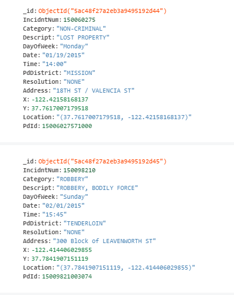
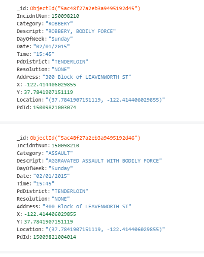
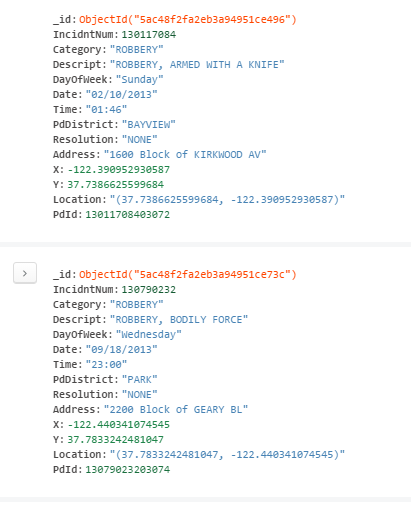
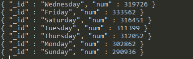
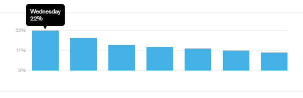

# Mongodb

# Requirements
* Mongodb

## Installation
* Download mongodb
* Download Compass
* Run mongo (recordar poner en el path)

## Importing csv
* Descargamos csv desde la web:
  * Forma 1: en consola escribimos
  ```
  mongoimport -d datascience -c incidents --type csv --file Incidents.csv --headerline
  ```
  * Forma 2: Hemos escrito un script en python2, load_data.py que realiza la misma funcion
  ```
  #!/usr/bin/env python
  import os
  from pymongo import MongoClient
  import pandas as pd
  import json
  import progressbar

  STEP = 200

  def import_content(filepath):
     # cdir = os.path.dirname(__file__)
     # file_res = os.path.join(cdir, filepath)
     client = MongoClient()

     # Creates the database for the San Francisco city incidents data
     db = client['datascience']

     # Creates the collection of the documents of that will represent the incidents
     incid = db.incidents
     # We delete any content of the incidents collection, just in case it has anything
     incid.remove()

     # Reads the csv file into python's dataframe type (in my case I named it incid.csv)
     csv = pd.read_csv('Incidents.csv')

     bar = progressbar.ProgressBar()
     for start in bar(range(0, len(csv.index), STEP)):
        partial_csv = csv.ix[start:(start + STEP), :]

        # Reads the dataframe as json using orient=records,
        # form info https://pandas.pydata.org/pandas-docs/stable/generated/pandas.DataFrame.to_json.html
        csv_to_json = json.loads(partial_csv.to_json(orient='records'))

        # We bulk all data in
        incid.insert(csv_to_json)

        # we free some memory as csv is not needed anymore ;)
        del partial_csv
        del csv_to_json
        
  if __name__ == "__main__":
     filepath = '~/Downloads/incid.csv'
     import_content(filepath)
 
## Queries
Cuando accedemos a los datos de los campos de un documento en MongoDB podemos encontrarnos la necesidad de realizar consultas MongoDB like. Es decir, realizar consultas por cadenas similares de texto. Por ejemplo, nombres que empiecen por una letra o letras, palabras que contengan una cierta cadena de caracteres,...

Las consultas MongoDB like se resuelven mediante expresiones regulares. Lo que realizaremos mediante la siguinte sintaxis:
```
db.coleccion.find({campo:expresión_regular});
```
Para los patrones de las expresiones regulares MongoDB utiliza “Perl Compatible Regular Expressions” (PCRE). 

Ejemplos de consultas:

* Número de incidencias por zona/dia
  * Incidencias en dia Sunday
  ```
  db.find({DayOfWeek:"Sunday"}).pretty()
  ```
  
  * Número de incidencias en Sunday
  ```
   db.incidents.count({DayOfWeek:"Sunday"})
   290936
  ```
  
  * Incidencias en el dia 02/01/2015
  ```
  db.find({Date:"02/01/2015"}).pretty()
  ```
   
  * Número de incidencias el 02/01/2015
  ```
   db.incidents.count({Date:"02/01/2015"})
   466
  ```
  
   * Incidencias en la Zona de LEAVENWORTH
  ```
  db.incidents.find({Address:/LEAVENWORTH/}).pretty()
  ```
  * Número de incidencias en LEAVENWORTH
  ```
   db.incidents.count({Address:/LEAVENWORTH/})
   28163
  ```
  
* Número de incidencias por año/dia (por tipo de delito)

  * Incidencias en el año 2013 para los delitos ROBBERY
  ```
  db.incidents.find({Date:/2013/,Category:"ROBBERY"}).pretty()
  ```
  
  * Número de incidencias de la busqueda anterior
  ```
   db.incidents.count({Date:/2013/,Category:"ROBBERY"})
   4196
  ```
* Frecuencia de incidencias por dia de la semana

  ```
  db.incidents.aggregate([{$group:{day:"$DayOfWeek",num:{$sum:1}}}])
  ```
  
  
  
## Referencias
* [Manipulación de datos en MongoDB mediante Aggregation Pipeline](https://www.adictosaltrabajo.com/tutoriales/mongodb-agregatte/)
* [Consultas MongoDB Like](http://lineadecodigo.com/mongodb/consultas-mongodb-like/)
* [Operacionas de consultas avanzadas](http://charlascylon.com/2013-07-10-tutorial-mongodb-operaciones-de-consulta-avanzadas)
