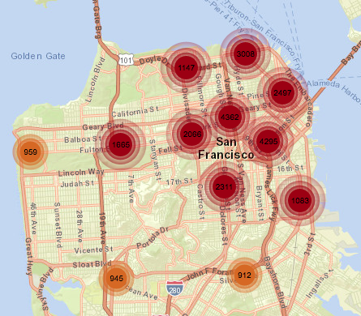

# Fase de Procesamiento de datos

* Introducción
* Información
  * Estructura de la información
  * Limpieza e importación


----

## Introducción

La información del dataset proporcionada por el departamento Policial de San Francisco, se encuentra abierta al público y contiene datos de todas las incidencias generadas por actividades criminales producidas desde el año 2003 hasta la actualidad. Esta información se encuentra expuesta de forma pública desde el sistema de actualización diaria del SFPD Crime Incident Reporting (sistema de reportes del departamento policial) a traves de su plataforma Socrata.

## Información origen
### Estructura de la información
La información esta representada por un conjunto de 2 millones de filas, que contiene información detallada de actividades criminales (o incidencias) representada por: tipo de delito, resolución, distrito, coordenadas y dirección de la zona, nº de incidencia vinculada, todos producidos entre el 2003 hasta la actualidad.



```
150060275;NON-CRIMINAL;LOST PROPERTY;Monday;2015-01-19 14:00:00;MISSION;NONE;18TH ST / VALENCIA ST;-122.42158168137;37.7617007179518;(37.7617007179518, -122.42158168137);15006027571000
```

La fuente de datos necesaria para realizar nuestro análisis de datos se puede descargar desde una página proporcionada por el sistema de datos del departamento policial, a través de la vista ofrecida por el portal de datos Socrata Open Data, el cual proporciona documentación para extraer reportes y las incidencias mencionadas por descargas manuales o servicios de actualizaciones a través de sus APIs. El informe sobre dicha entrada se encuentra bajo la entrada del portal:

[](https://dev.socrata.com/foundry/data.sfgov.org/cuks-n6tp)

Desde la página que contiene la visualización de un mapa de incidencias basado en este dataset, solamente se pueden descargar versiones del dataset para el año actual. Esto ocurre desde la fecha del 3 de Marzo del 2018, bajo indicación de la última notificación, ofrecida desde la vista Socrata para dicho reporte:

```
[Change Notice 03/13/2018]: By the end of this month, this dataset will become historical and a new one will be created starting with incident data in 2018. This one will remain here, but no longer be updated. The new one will have data coming from a new system, will not have a 2 week lag, and 
have updated districts among other quality improvements. We will attach a guide here with more detailed change updates as soon as we have them.
```

### ¿Dónde podemos encontrar la versión adecuada?

El dataset, sin filtros y con información desde el 2003 hasta la actualidad (dos semanas antes de la fecha actual), se puede descargar como documento CSV/TSV a partir de una entrada al portal proporcionado por Socrata:


## Limpieza e Importación de datos

Toda la información que se muestra en el mapa de incidencias, si desactivamos los filtros por defecto, se puede descargar mediante línea de comandos gracias al portal Socrata, lo haremos de la siguiente manera:

```
$ wget -O incidents.raw.tsv \
  		"https://data.sfgov.org/api/views/tmnf-yvry/rows.tsv?accessType=DOWNLOAD&api_foundry=true"
```

La limpieza de datos se ha hecho en acorde al modelo de datos requerido para Cassandra,  Neo4j o Mongodb; pero en general se han recuperado la mayoría de las columnas. 


* [Neo4j](neo4j/readme.md#preprocesamiento-e-importación-de-datos)
* [Mongodb](mongodb/readme.md#preprocesamiento-e-importación-de-datos)
* [Cassandra](cassandra/readme.md#preprocesamiento-e-importación-de-datos)
* [Processorcpp](processorcpp/readme.md#preprocesamiento-e-importación-de-datos)


## Estructura de datos

La estructura de datos se he conservado de forma homogénea para cada tipo de motor, con el dato común de utilización de un formato de fecha fusionado en un solo campo. Tenemos las siguientes implementaciones del modelo de datos:


* [Neo4j](neo4j/readme.md#estructura-de-datos)
* [Mongodb](mongodb/readme.md#estructura-de-datos)
* [Cassandra](cassandra/readme.md#estructura-de-datos)
* [Processorcpp](processorcpp/readme.md#estructura-de-datos)


## Consultas
Hemos generalizado los tipos de consultas dependendiendo a las expectativas sobre la aplicación, en acorde a los siguientes usos:

* Obtener toda las incidencias para un periodo de tiempo. 
* Actividad criminal por zona
* Actividad criminal por tipo de delito
* Nº incidencias agrupadas por zona / *año*
* Nº incidencias agrupadas por delito / *año*

Todas se pueden encontrar implementadas bajo:

* [Neo4j](neo4j/readme.md#consultas)
* [Mongodb](mongodb/readme.md#consultas)
* [Cassandra](cassandra/readme.md#consultas)
* [Processorcpp](processorcpp/readme.md#consultas)
